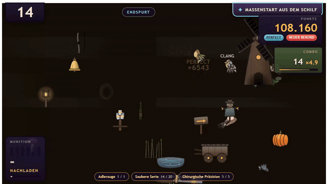

<div align="center">

<a href="https://benchmark.securesight.ai">
  <picture>
    <source media="(prefers-reduced-motion: reduce)" srcset="media/banner/hero-still.webp">
    
  </picture>
</a>

<h3>Which models deliver which results, and how fast?</h3>

<p>No standard benchmarks, but image recognition and agentic coding with VS Code<br>
tried out first hand on local, affordable AMD hardware.</p>

<p>
  <a href="https://benchmark.securesight.ai"><b>Website</b></a> ·
  <a href="#at-a-glance">At a glance</a> ·
  <a href="#halogen-the-fastest-run">Halogen</a> ·
  <a href="#start-here">Start here</a> ·
  <a href="#every-measured-run">Results</a> ·
  <a href="#what-the-models-built">Games</a> ·
  <a href="#nine-findings">Findings</a> ·
  <a href="#verify-every-number">Verify</a> ·
  <a href="#faq">FAQ</a>
</p>

<p>
  <a href="https://benchmark.securesight.ai"></a>
  <a href="#halogen-the-fastest-run"></a>
  <a href="#verify-every-number"></a>
  <a href="evidence/SHA256SUMS"></a>
  
  <a href="#license-and-citation"></a>
</p>

</div>

## At a glance

Every local model got one of two prompts in VS Code Copilot Chat and then worked on its own
against a server on the local network: `llama-server`, and Halogen in one run. What it
shipped is a playable game. What the server log recorded is what it cost, and two
independent scripts re-derive every agent run figure from those logs. Each run has its own
page on
**[benchmark.securesight.ai](https://benchmark.securesight.ai)** with a video, the playable
build and the launch line or server setup to copy.

**My pick per machine**

<table>
<tr>
<th width="50%" align="left">AMD AI MAX 395 (AMD Halo)<br><sub>128 GiB unified LPDDR5X · GMKtec EVO-X2</sub></th>
<th width="50%" align="left">Radeon AI PRO R9700<br><sub>32 GB dedicated · RDNA4</sub></th>
</tr>
<tr>
<td valign="top">

**[Qwen3.8-Flash-Next](https://benchmark.securesight.ai/m/qwen38-flash-next/en?lauf=qwen38-flashnext-moorhuhn-halogen-evox2)** · W4B · Halogen<br>
<sub>halogen-flash-server 0.6.3 on Linux, MTP depth 1 plus prompt lookup</sub>

**38.28 t/s** decode median, 652 responses<br>
**1,120.69 t/s** prefill median from 8,192 new tokens<br>
917 requests · 1,177,886 tokens generated<br>
11 test files with 1,876 lines · quality not assessed yet

<sub>[Raw log](evidence/logs/qwen38-flashnext-moorhuhn-halogen-evox2.log) · [Every figure](#halogen-the-fastest-run) · [Play the game](https://benchmark.securesight.ai/spiel/qwen38-flashnext-moorhuhn-halogen-evox2/)</sub>

</td>
<td valign="top">

**[Qwen3.8-27B](https://benchmark.securesight.ai/m/qwen38-27b/en?lauf=qwen38-27b-q4xl-moorhuhn-r9700)** · UD-Q4_K_XL<br>
<sub>MTP draft `n_max 2` plus `ngram-mod` 24/48/64</sub>

**33.69 t/s** decode median, 82 responses<br>
**31 / 40** quality, confirmed<br>
The log covers the first of two sessions<br>
11 test files with 1,257 lines

<sub>[Raw log](evidence/logs/qwen38-27b-q4xl-moorhuhn-r9700.log) · [Launch line](#start-here) · [Play the game](https://benchmark.securesight.ai/spiel/qwen38-27b-q4xl-moorhuhn-r9700/)</sub>

</td>
</tr>
</table>

> With these two models I ran the longest agentic autonomous jobs, of up to 13.6 h, and at the
> same time got very good results at a usable median speed of over 20 t/s. For me, on this
> hardware and as of September 2026, that is the best compromise between quality and speed,
> without paying for tokens, without depending on cloud providers and without sharing my data.
>
> **Qwen3.8-Flash-Next.** Not the highest quality, but it makes use
> of the advantages of the AMD Strix Halo, meaning it uses the entire VRAM, already includes the
> Qwen 4 architecture and delivers well at a steady speed.
>
> **Qwen3.8-27B.** The first model I would also recommend for coding on a GPU with 24–32 GB of
> VRAM. In Q4 it runs stably and agentically for hours, writes tests and reviews itself. If I
> were to recommend one model in the range up to 32 GB of VRAM, it would definitely be this one.
>
> **Kai Bennett**

## Halogen, the fastest run

<div align="center">
<a href="https://benchmark.securesight.ai/spiel/qwen38-flashnext-moorhuhn-halogen-evox2/"></a>
</div>

The same model with the same Moorhuhn prompt, byte for byte, on the same AMD AI MAX 395, served by
[halogen-flash-server](https://github.com/peonist-ai/halogen-flash-server) 0.6.3 on Linux with the
[W4B weights](https://huggingface.co/peonist-ai/halogen-qwen3.8-flash-next) and their quality
overlay. No other agent run in this repository decodes faster, and large prompts go in at a
median of 1,120.69 t/s.

| Decode median | Decode p10 to p90 | Prefill from 8,192 new tokens | Requests | Tokens generated | Working window |
|--:|--:|--:|--:|--:|--:|
| **38.28 t/s** | 33.08 to 43.65 t/s | **1,120.69 t/s** | 917 | 1,177,886 | 11.7 h |

<details>
<summary><b>Every figure of the Halogen run</b></summary>

<br>

| Figure | Value | Read from |
|---|---|---|
| Decode median | **38.28 t/s** over 652 of 891 responses, those of 200 tokens or more | the `serve_api: mtp` line the server writes per response |
| Decode p10 to p90 · peak | 33.08 to 43.65 t/s · 61.80 t/s | the same lines |
| Prefill median from 8,192 new tokens | **1,120.69 t/s** over 39 requests, 35 of them above 1,000 t/s | prompt size, cached part and prefill time in the same lines |
| Prefill median over all 891 responses | 347.85 t/s; a request brought 654 new tokens in the median | the same lines |
| Fastest prefill | 1,241.74 t/s | the same lines |
| Largest prompt | 149,681 tokens | the same lines |
| Prompt tokens | 50,510,287 in total: 2,862,509 new, 47,647,778 from the prompt cache | the same lines |
| Tokens generated | 1,177,886 over all responses | the same lines |
| GPU time | 634.9 min: 558.8 decode plus 76.1 prefill | the same lines |
| Next to a second request | 268 of the 652 scored responses | `beside other streams` in the same lines |
| Requests | 917 sent by VS Code, 891 of them answered | the proxy's `Anfrage` lines |
| Working window | 703.3 min: 1,121.6 min from the first request to the last answer, minus seven pauses over 60 s totalling 418.3 min | the proxy's time stamps |
| Delivered | 65 files, 20,887 lines including tests, 11 test files with 1,876 lines | [`benchmarks/qwen38-flashnext/moorhuhn-halogen/`](benchmarks/qwen38-flashnext/moorhuhn-halogen/) |
| Server | halogen-flash-server 0.6.3 in a container, W4B with quality overlay, MTP depth 1 plus prompt lookup, two slots sharing one KV pool of 262,144 positions | the startup lines at the top of the log |
| Machine | AMD AI MAX 395 on Linux, 2.0 GiB reserved for the iGPU in firmware | the startup lines at the top of the log |
| Quality | not assessed yet | |
| Image recognition, a separate test | 42 of 50 values read, 1 of 4 price tags, 3 of 4 traps, in the repeat of 18 September with the original images | [finding 8](#8-local-models-read-almost-as-well-as-the-cloud-reference) |

</details>

<sub>Every measured figure above is printed by <code>python scripts/parse_logs.py</code> from the <a href="evidence/logs/qwen38-flashnext-moorhuhn-halogen-evox2.log">raw log</a>, and <code>scripts/verify_runs.py</code> checks the ones stored in <code>data/runs.json</code>. The prompt is <a href="evidence/prompts/qwen38-flashnext-moorhuhn-evox2.txt"><code>evidence/prompts/qwen38-flashnext-moorhuhn-evox2.txt</code></a>, and <code>benchmarks/qwen38-flashnext/moorhuhn-halogen/prompt.md</code> has the same SHA-256. What went wrong during the run, and how it compares with the llama.cpp run, is <a href="#9-same-model-same-machine-another-server">finding 9</a>.</sub>

**[Play it in your browser](https://benchmark.securesight.ai/spiel/qwen38-flashnext-moorhuhn-halogen-evox2/)** · [Watch the video and read the server setup](https://benchmark.securesight.ai/m/qwen38-flash-next/en?lauf=qwen38-flashnext-moorhuhn-halogen-evox2) · [Read the source](benchmarks/qwen38-flashnext/moorhuhn-halogen/)

## Start here

**1. Copy the setup behind a pick.** Halogen runs as a container and has no launch line; its
setup is the header its start script wrote into the log. For llama.cpp there are two launch
lines, Qwen3.8-Flash-Next from its llama.cpp run and the Qwen3.8-27B pick, and the logs confirm
them: the Flash-Next log records its MTP draft model being loaded and a slot context of 131,072,
the Qwen3.8-27B log a slot context of 262,144.

<details>
<summary><b>AMD AI MAX 395 · Qwen3.8-Flash-Next W4B on Halogen</b></summary>

```text
  Halogen Qwen3.8-Flash-Next W4B + Qualitaets-Overlay + Vision  (ghcr.io/peonist-ai/halogen-flash-server:0.6.3)

  Kontext  : 262144 je Request, KV-Pool 262144 Positionen, 2 Slot
  Budget   : max_tokens-Default 65536 je Anfrage, Cap 262144, Slots 2
  Reasoning: xhigh, getrennt in reasoning_content
  Sampling : temp 1.0  top_p 0.95  top_k 20  min_p 0.0  presence 0.0  (nur fuer fehlende Felder)
  Cache    : Prompt-Cache 2, Queue-Timeout 28800 s
  Vision   : an (qwen38-flash-next-vision.hgn)
  RAM      : 123 GiB sichtbar, 13 GiB belegt, 1179 freie 2-MiB-Bloecke
  Endpoint : http://127.0.0.1:18099/v1 (VS Code ueber Live-Log-Proxy :8099)   Modell: halogen-qwen3.8-flash-next-w4b-quality-overlay
  Watchdog : 0 (0 = aus)

  Laden: gemessen 30 s (13.09., Pool 32768); bei fragmentiertem Speicher ueber 5 min.
```

<sub>Verbatim from lines 4 to 16 of the <a href="evidence/logs/qwen38-flashnext-moorhuhn-halogen-evox2.log">raw log</a>. Server: <a href="https://github.com/peonist-ai/halogen-flash-server">peonist-ai/halogen-flash-server</a> · weights: <a href="https://huggingface.co/peonist-ai/halogen-qwen3.8-flash-next">peonist-ai/halogen-qwen3.8-flash-next</a>. VS Code talked to the logging proxy at <code>http://127.0.0.1:8099/v1</code>.</sub>

</details>

<details>
<summary><b>AMD AI MAX 395 · Qwen3.8-Flash-Next UD-Q4_K_XL on llama.cpp</b></summary>

```bash
llama-server \
  -m Qwen3.8-Flash-Next-UD-Q4_K_XL-00001-of-00004.gguf \
  -md mtp-Qwen3.8-Flash-Next-shared-Q8_0.gguf \
  --spec-type draft-mtp --spec-draft-n-max 2 \
  --mmproj mmproj-F16.gguf --alias qwen3.8-flash-next \
  --host 127.0.0.1 --port 8099 --device Vulkan0 --gpu-layers all \
  --n-cpu-moe 0 --fit off -fa on --load-mode mmap --lazy-mode on \
  --ctx-size 131072 --parallel 1 --kv-unified \
  -ctk q8_0 -ctv q8_0 -b 2048 -ub 512 \
  --ctx-checkpoints 4 --checkpoint-min-step 4096 --jinja \
  --reasoning on --reasoning-format deepseek \
  --reasoning-effort xhigh --reasoning-budget 12000 \
  --temp 1.0 --top-p 0.95 --top-k 20 --min-p 0.0 \
  --presence-penalty 0.0 --repeat-penalty 1.0
```

<sub>From <code>start-qwen38-flash-next.bat</code>, which names its build folder <code>llama.cpp-qwen4exp-pr28243</code>. Endpoint <code>http://127.0.0.1:8099/v1</code>.</sub>

</details>

<details>
<summary><b>Radeon AI PRO R9700 · Qwen3.8-27B UD-Q4_K_XL</b></summary>

```bash
llama-server -m Qwen3.8-27B-UD-Q4_K_XL.gguf \
  --load-mode none --mmproj mmproj-F16.gguf --image-min-tokens 1024 \
  --alias Qwen3.8-27B -dev Vulkan0 --host 127.0.0.1 --port 8080 \
  -c 262144 -ngl 99 -fa on --fit off -ot "token_embd\.weight=Vulkan0" \
  -ctk q8_0 -ctv q8_0 -b 2048 -ub 288 \
  --parallel 1 --kv-unified \
  --ctx-checkpoints 4 --checkpoint-min-step 16384 --cache-ram 0 \
  --spec-type draft-mtp,ngram-mod --spec-draft-n-max 2 \
  --spec-ngram-mod-n-match 24 --spec-ngram-mod-n-min 48 --spec-ngram-mod-n-max 64 \
  --spec-draft-device Vulkan0 --spec-draft-ngl 99 \
  --temp 1.0 --top-p 0.95 --top-k 20 --min-p 0.0 \
  --presence-penalty 0.0 --repeat-penalty 1.0 \
  --jinja --reasoning on --reasoning-effort xhigh --reasoning-format deepseek --reasoning-budget -1
```

<sub>llama.cpp <code>b10717</code>, Vulkan. Endpoint <code>http://127.0.0.1:8080/v1</code>. Seventeen more launch configurations for both machines are in <a href="data/configs.json"><code>data/configs.json</code></a>.</sub>

</details>

**2. Connect VS Code.** `llama-server` speaks the OpenAI API. VS Code accepts such endpoints
through "bring your own key", without a Copilot subscription and without signing in
([VS Code documentation](https://code.visualstudio.com/docs/agent-customization/language-models)).
The agents used here are in [`harness/agents/`](harness/agents/): drop them into
`.github/agents/` and they show up in the chat picker.

**3. Check that this repository is not lying to you.**

```bash
git clone https://github.com/KaiFelixBennett/local-ai-amd-benchmark
cd local-ai-amd-benchmark
cd evidence && sha256sum -c SHA256SUMS && cd ..   # the raw files are the ones cited
python scripts/parse_logs.py                      # re-derive every agent run figure
python scripts/verify_runs.py                     # cross-check data/runs.json against the logs
```

Python 3, no dependencies. `parse_logs.py` also reads a log of your own: pass its path.

## Every measured run

Seven agent runs have a raw server log. Their speed is the median over every response of 200
tokens or more in that log.

| Model | Task | Decode | Quality | Tests | Evidence |
|---|---|--:|--:|--:|---|
| **Radeon AI PRO R9700** | | | | | |
| Qwen3.8-27B<br><sub>UD-Q4_K_XL</sub> | Moorhuhn | **33.69** | **31** ✓ | 11 | [log](evidence/logs/qwen38-27b-q4xl-moorhuhn-r9700.log) · [page](https://benchmark.securesight.ai/m/qwen38-27b/en?lauf=qwen38-27b-q4xl-moorhuhn-r9700) |
| Qwen3.6-27B<br><sub>UD-Q6_K_XL</sub> | Moorhuhn | **33.45** | 20 | 0 | [log](evidence/logs/qwen36-27b-q6-moorhuhn-r9700.log) · [page](https://benchmark.securesight.ai/m/qwen36-27b/en?lauf=qwen36-27b-q6-moorhuhn-r9700) |
| Qwen3.8-27B<br><sub>UD-Q6_K_M</sub> | Clair Obscure | **26.30** | 28 | 0 | [log](evidence/logs/qwen38-27b-q6-clairobscur-r9700.log) · [page](https://benchmark.securesight.ai/m/qwen38-27b/en?lauf=qwen38-27b-q6-clairobscure-r9700) |
| **AMD AI MAX 395 (AMD Halo)** | | | | | |
| Qwen3.8-Flash-Next<br><sub>UD-Q4_K_XL</sub> | Moorhuhn | **21.76** | **35** ✓ | 10 | [log](evidence/logs/qwen38-flashnext-moorhuhn-evox2.log) · [page](https://benchmark.securesight.ai/m/qwen38-flash-next/en?lauf=qwen38-flashnext-moorhuhn-evox2) |
| Qwen3.8-Flash-Next<br><sub>W4B · Halogen</sub> | Moorhuhn | **38.28** | — | 11 | [log](evidence/logs/qwen38-flashnext-moorhuhn-halogen-evox2.log) · [page](https://benchmark.securesight.ai/m/qwen38-flash-next/en?lauf=qwen38-flashnext-moorhuhn-halogen-evox2) |
| Qwen3.8-Flash-Next<br><sub>UD-Q4_K_XL</sub> | Clair Obscure | **10.93** | 22 | 0 | [log](evidence/logs/qwen38-flashnext-clairobscur-halo.log) · [page](https://benchmark.securesight.ai/m/qwen38-flash-next/en?lauf=qwen38-flashnext-clairobscure-evox2) |
| DeepSeek-V4-Flash-0731<br><sub>UD-IQ3_XXS</sub> | Clair Obscure | **7.02** | 16 | 0 | [log](evidence/logs/deepseek-v4-flash-clairobscur-halo.log) · [page](https://benchmark.securesight.ai/m/deepseek-v4-flash-0731/en?lauf=deepseek-v4-flash-clairobscure-evox2) |

<sub><b>Decode</b> median in t/s · <b>Quality</b> rubric of four criteria with 10 points each (game feel, presentation, code quality, scope), ✓ confirmed, — not assessed yet, the others are proposals · <b>Tests</b> files named <code>*.test.*</code> in the delivered project · <b>page</b> the model page with video, playable build and the reason behind every rubric point.<br>
The Qwen3.8-27B UD-Q4_K_XL log covers the first of two sessions. For the Flash-Next Clair Obscure run the run notes record an older MTP version, but its log shows no draft model being loaded and no draft acceptance line, so this log cannot show what MTP contributed. The Halogen run used another server on Linux, halogen-flash-server 0.6.3 with weights in W4B, and served two requests at a time: 268 of its 652 scored responses ran next to a second one.</sub>

<details>
<summary>Percentiles, prefill, largest prompt, tokens and GPU time per run</summary>

<br>

| Run | n | Decode p10 to p90 | Prefill | Largest prompt | Tokens | GPU min |
|---|--:|--:|--:|--:|--:|--:|
| Qwen3.8-27B UD-Q4_K_XL · Moorhuhn | 82 of 108 | 27.83 to 45.34 | 234.86 | 139,720 | 336,107 | 188.9 |
| Qwen3.6-27B UD-Q6_K_XL · Moorhuhn | 221 of 409 | 29.02 to 38.25 | 152.71 | 43,238 | 196,543 | 139.1 |
| Qwen3.8-27B UD-Q6_K_M · Clair Obscure | 30 of 35 | 15.55 to 34.22 | 159.40 | 180,396 | 119,627 | 114.5 |
| Qwen3.8-Flash-Next · Moorhuhn | 346 of 459 | 17.15 to 26.28 | 77.63 | 69,985 | 786,506 | 798.8 |
| Qwen3.8-Flash-Next W4B · Halogen · Moorhuhn | 652 of 891 | 33.08 to 43.65 | 347.85<br><sub>1,120.69 from 8,192 new tokens</sub> | 149,681 | 1,177,886 | 634.9 |
| Qwen3.8-Flash-Next · Clair Obscure | 92 of 106 | 9.70 to 13.85 | 109.74 | 35,009 | 238,371 | 368.0 |
| DeepSeek-V4-Flash-0731 · Clair Obscure | 98 of 152 | 4.85 to 9.89 | 15.24 | 36,962 | 158,469 | 500.3 |

<sub><b>n</b> scored responses of all responses · <b>Prefill</b> median t/s over all prompts; Halogen logs no prefill rate, so there it is the new prompt tokens divided by the prefill time the server reports. Its requests bring 654 new tokens in the median, and requests with 32 to 511 new tokens already took 1.46 s in the median, so its median over all prompts describes those small steps; from 8,192 new tokens up its prefill median is 1,120.69 t/s over 39 requests · <b>Tokens</b> generated over all responses · <b>GPU min</b> decode plus prefill as timed by the server. Totals as <code>parse_logs.py</code> prints them: 1,521 scored responses, 3,013,509 tokens generated, 45.7 h of GPU time.</sub>

</details>

<details>
<summary>Runs without an agent log: synthetic sweeps, a second pass and cloud references</summary>

<br>

| Model | Task | What exists | Quality | Tests | Evidence |
|---|---|---|--:|--:|---|
| Qwen3.5-122B-A10B<br><sub>UD-Q4_K_XL · AI MAX 395</sub> | Lab test | synthetic: 31.80 t/s decode with MTP, 245.71 t/s pp512 | 4 | 0 | [report](evidence/reports/qwen35-122b-a10b-strix-halo-vulkan-benchmark.md) · [page](https://benchmark.securesight.ai/m/qwen35-122b-a10b/en) |
| Laguna S 2.1<br><sub>AI MAX 395</sub> | Clair Obscure | synthetic in Q4_K_M: 20.71 t/s tg128, 338.68 t/s pp512; the game was built in UD-Q4_K_XL without a server log | 22 | 0 | [report](evidence/reports/laguna-s21-strix-halo-vulkan-benchmark.md) · [page](https://benchmark.securesight.ai/m/laguna-s-21/en) |
| Qwen3.8-27B, reasoning medium<br><sub>UD-Q4_K_XL · R9700</sub> | Moorhuhn | the launch line above with <code>--reasoning-effort medium</code>; no server log, 6 h 28 min read from VS Code | 26 | 10 | [chat](evidence/chats/qwen38-27b-q4xl-moorhuhn-medium-r9700.md) · [page](https://benchmark.securesight.ai/m/qwen38-27b/en?lauf=qwen38-27b-q4xl-moorhuhn-medium-r9700) |
| Qwen3.6-27B<br><sub>UD-Q6_K_XL · R9700</sub> | Clair Obscure | the build only, no server log was kept | 22 | 0 | [page](https://benchmark.securesight.ai/m/qwen36-27b/en?lauf=qwen36-27b-q6-clairobscure-r9700) |
| Sonnet 5<br><sub>cloud reference</sub> | Moorhuhn | the build; cloud speed is not measured on purpose | 32 | 11 | [page](https://benchmark.securesight.ai/m/sonnet-5/en) |
| Opus 5 ULTRACODE<br><sub>cloud reference</sub> | Clair Obscure | the build; cloud speed is not measured on purpose | 34 | 0 | [page](https://benchmark.securesight.ai/m/opus-5-ultracode/en) |
| GPT 5.6 Sol, Opus 5 ULTRACODE<br><sub>cloud reference</sub> | Moorhuhn | pending, only the prompt exists | | | [page](https://benchmark.securesight.ai/m/gpt-56-sol/en) |

</details>

<div align="center">
<picture>
  <source media="(prefers-color-scheme: dark)" srcset="media/chart/field-dark.svg">
  
</picture>
</div>

<sub>Filled points are agent runs, hollow points synthetic sweeps, a different measurement. The dashed line is the Pareto front of the agent runs, the runs no other agent run beats on both axes: Qwen3.8-Flash-Next on Moorhuhn (21.76 t/s, 35) and Qwen3.8-27B UD-Q4_K_XL (33.69 t/s, 31). Drawn from <code>data/runs.json</code> by <code>scripts/make_chart.py</code>, so the picture cannot drift from the data. The Halogen run has no quality score yet and is not drawn.</sub>

> [!IMPORTANT]
> **There is no overall ranking here.** Any weighting of speed against quality is an opinion, so
> this repository does not publish a total score. Decode t/s follows model size, memory bandwidth
> and speculation settings, not how good a model is. Quality is a rubric scored by a person, with
> a written reason for every point on the model pages; two scores are confirmed, the others are
> proposals.

## One prompt, 13 h 35 min

<div align="center">
<a href="https://benchmark.securesight.ai/spiel/qwen38-flashnext-moorhuhn-evox2/"></a>
</div>

> Qwen3.8-Flash-Next on the AMD AI MAX 395, 177 billion parameters, roughly six of them active.
> 459 requests, 786,506 tokens generated, not a single intervention. Graphics, menus, sound,
> backend: all of it generated along the way. The large models can do this too, of course, but in
> places I found the result even better than Sonnet 5's.
>
> **Kai Bennett**

| Requests | Tokens generated | GPU time | Working window | Delivered |
|--:|--:|--:|--:|---|
| 459 | 786,506 | 798.8 min | 815 min | 55 files, 10,531 lines, 10 test files with 1,398 lines |

<sub>Requests, tokens and GPU time come from the <a href="evidence/logs/qwen38-flashnext-moorhuhn-evox2.log">raw log</a>, the working window from its time stamps: the server ran for 844.3 minutes, and the first task to the end of the last took 837.0 minutes including one idle pause of 21.9 minutes. The line counts can be checked in <a href="benchmarks/qwen38-flashnext/moorhuhn-q4xl/"><code>benchmarks/</code></a>.</sub>

**[Play it in your browser](https://benchmark.securesight.ai/spiel/qwen38-flashnext-moorhuhn-evox2/)** · [Read the prompt](evidence/prompts/qwen38-flashnext-moorhuhn-evox2.txt) · [Watch the uncut video](https://benchmark.securesight.ai/m/qwen38-flash-next/en?lauf=qwen38-flashnext-moorhuhn-evox2)

What went wrong is on record too. The loading screen says "Featherstorm wordt geladen", Dutch
instead of German, in exactly one spot of an otherwise German game. And the run needed three
sessions of 20, 376 and 419 minutes; between them the context was lost and had to be rebuilt.

## What the models built

Every clip is the model's own build, recorded from what it delivered. The full source of every
run is in [`benchmarks/`](benchmarks/), exactly as the model left it, and ten of the builds run
in your browser on the website. The Moorhuhn prompt asks for a finished arcade shooter with
modes, menus, statistics and tests. The Clair Obscure prompt asks for a single fight with parry
and dodge on tight timing windows.

<table>
<tr>
<td width="50%" valign="top">
<a href="https://benchmark.securesight.ai/spiel/qwen38-27b-q4xl-moorhuhn-r9700/"></a>
<b>Moorhuhn</b> · Qwen3.8-27B UD-Q4_K_XL · R9700<br>
<sub>42 files · 10,839 lines · 11 test files · quality 31, confirmed<br>
<a href="https://benchmark.securesight.ai/spiel/qwen38-27b-q4xl-moorhuhn-r9700/">Play</a> · <a href="https://benchmark.securesight.ai/m/qwen38-27b/en?lauf=qwen38-27b-q4xl-moorhuhn-r9700">Video</a> · <a href="benchmarks/qwen38-27b/moorhuhn-q4xl-xhigh/">Source</a></sub>
</td>
<td width="50%" valign="top">
<a href="https://benchmark.securesight.ai/spiel/sonnet5/"></a>
<b>Moorhuhn</b> · Sonnet 5 · cloud reference<br>
<sub>72 files · 9,433 lines · 11 test files · quality 32, proposal<br>
<a href="https://benchmark.securesight.ai/spiel/sonnet5/">Play</a> · <a href="https://benchmark.securesight.ai/m/sonnet-5/en">Video</a> · <a href="benchmarks/sonnet5/moorhuhn/">Source</a></sub>
</td>
</tr>
<tr>
<td width="50%" valign="top">
<a href="https://benchmark.securesight.ai/spiel/qwen38-27b-q6-clairobscure-r9700/"></a>
<b>Clair Obscure</b> · Qwen3.8-27B UD-Q6_K_M · R9700<br>
<sub>36 files · 11,115 lines · quality 28, proposal<br>
<a href="https://benchmark.securesight.ai/spiel/qwen38-27b-q6-clairobscure-r9700/">Play</a> · <a href="https://benchmark.securesight.ai/m/qwen38-27b/en?lauf=qwen38-27b-q6-clairobscure-r9700">Video</a> · <a href="benchmarks/qwen38-27b/clairobscure-q6/">Source</a></sub>
</td>
<td width="50%" valign="top">
<a href="https://benchmark.securesight.ai/spiel/qwen38-flashnext-clairobscure-evox2/"></a>
<b>Clair Obscure</b> · Qwen3.8-Flash-Next UD-Q4_K_XL · AI MAX 395<br>
<sub>29 files · 6,157 lines · quality 22, proposal<br>
<a href="https://benchmark.securesight.ai/spiel/qwen38-flashnext-clairobscure-evox2/">Play</a> · <a href="https://benchmark.securesight.ai/m/qwen38-flash-next/en?lauf=qwen38-flashnext-clairobscure-evox2">Video</a> · <a href="benchmarks/qwen38-flashnext/clairobscure-q4xl/">Source</a></sub>
</td>
</tr>
<tr>
<td width="50%" valign="top">
<a href="https://benchmark.securesight.ai/spiel/qwen36-27b-q6-moorhuhn-r9700/"></a>
<b>Moorhuhn</b> · Qwen3.6-27B UD-Q6_K_XL · R9700<br>
<sub>39 files · 6,903 lines · no tests · 12 <code>fix_*</code> repair scripts · quality 20, proposal<br>
<a href="https://benchmark.securesight.ai/spiel/qwen36-27b-q6-moorhuhn-r9700/">Play</a> · <a href="https://benchmark.securesight.ai/m/qwen36-27b/en?lauf=qwen36-27b-q6-moorhuhn-r9700">Video</a> · <a href="benchmarks/qwen36-27b/moorhuhn-q6/">Source</a></sub>
</td>
<td width="50%" valign="top">
<a href="https://benchmark.securesight.ai/spiel/laguna-s21-evox2/"></a>
<b>Clair Obscure</b> · Laguna S 2.1 UD-Q4_K_XL · AI MAX 395<br>
<sub>21 files · 5,994 lines · quality 22, proposal<br>
<a href="https://benchmark.securesight.ai/spiel/laguna-s21-evox2/">Play</a> · <a href="https://benchmark.securesight.ai/m/laguna-s-21/en">Video</a> · <a href="benchmarks/laguna-s21/clairobscure/">Source</a></sub>
</td>
</tr>
<tr>
<td width="50%" valign="top">
<a href="https://benchmark.securesight.ai/spiel/qwen38-flashnext-moorhuhn-halogen-evox2/"></a>
<b>Moorhuhn</b> · Qwen3.8-Flash-Next W4B · Halogen · AI MAX 395<br>
<sub>65 files · 20,887 lines · 11 test files · not assessed yet · this clip is played by a script<br>
<a href="https://benchmark.securesight.ai/spiel/qwen38-flashnext-moorhuhn-halogen-evox2/">Play</a> · <a href="https://benchmark.securesight.ai/m/qwen38-flash-next/en?lauf=qwen38-flashnext-moorhuhn-halogen-evox2">Video</a> · <a href="benchmarks/qwen38-flashnext/moorhuhn-halogen/">Source</a></sub>
</td>
<td width="50%" valign="top">
<a href="https://benchmark.securesight.ai/m/qwen36-27b/en?lauf=qwen36-27b-q6-clairobscure-r9700"></a>
<b>Clair Obscure</b> · Qwen3.6-27B UD-Q6_K_XL · R9700<br>
<sub>26 files · 8,705 lines · quality 22, proposal · too large to play in the browser<br>
<a href="https://benchmark.securesight.ai/m/qwen36-27b/en?lauf=qwen36-27b-q6-clairobscure-r9700">Video</a> · <a href="benchmarks/qwen36-27b/clairobscure-q6/">Source</a></sub>
</td>
</tr>
</table>

## Nine findings

Each one links to the measurement it came from. Where a source limits what can be claimed, that
limit is part of the finding.

### 1. Same speed, different afternoon

Two runs on the R9700 with the same Moorhuhn prompt:

| | Qwen3.8-27B UD-Q4_K_XL | Qwen3.6-27B UD-Q6_K_XL |
|---|--:|--:|
| Decode median | **33.69 t/s** | **33.45 t/s** |
| Test files | 11 with 1,257 lines | none |
| `fix_*` repair scripts in the project | none | 12 |
| Quality | 31, confirmed | 20, proposal |

Tokens per second did not tell these two apart, and they were entirely different afternoons.
It is not a controlled experiment: model generation, quant, llama.cpp build and speculation
settings differ. What the two share is the prompt, the machine and the speed.

<sub>Sources: <a href="evidence/logs/qwen38-27b-q4xl-moorhuhn-r9700.log">Qwen3.8-27B log</a> · <a href="evidence/logs/qwen36-27b-q6-moorhuhn-r9700.log">Qwen3.6-27B log</a> · count the files in <a href="benchmarks/qwen38-27b/moorhuhn-q4xl-xhigh/"><code>moorhuhn-q4xl-xhigh</code></a> and <a href="benchmarks/qwen36-27b/moorhuhn-q6/"><code>moorhuhn-q6</code></a></sub>

### 2. A speculation setting that wins in the lab can lose in an agent

Laguna S 2.1 with DFlash speculative decoding on the AMD AI MAX 395:

| `--spec-draft-n-max` | Measured in | Decode | Draft acceptance |
|---|---|--:|--:|
| off | single prompt | 20.4 t/s | |
| 15, the model card's value | single prompt | 8.1 t/s | 0.150 |
| 3 | single prompt | **27.9 t/s** | 0.559 |
| 3 | live VS Code agent session at about 26K context | **8.56 t/s** | 0.000 to 0.019 |

In the sweep, `n_max 3` looked like the answer. In real agent work the draft stopped being
accepted, and decode fell far below the 19 to 20 t/s the model manages at that depth without
speculation. A later comparison with DFlash on and off at the drafter's trained block size
(`n_max 15`, Q3_K_M target) lost on every workload: 29.38 against 31.22 t/s on code, 7.98
against 30.90 on prose, 11.63 against 30.77 on reasoning. DFlash stays off on this machine.

<sub>Source: <a href="evidence/reports/laguna-s21-strix-halo-vulkan-benchmark.md">Laguna report</a> §5.3, §5.8.1 and §6.2b. The report itself marks its earlier explanation in §6.2 as superseded.</sub>

### 3. MTP speculation does pay off

Qwen3.5-122B-A10B on the AMD AI MAX 395, draft depth sweep on a single prompt:

| `--spec-draft-n-max` | Decode | Draft acceptance |
|---|--:|--:|
| 0, no speculation | 20.55 t/s | |
| **2** | **31.80 t/s** | **0.866** |
| 3 | 31.05 t/s | 0.726 |
| 4 | 31.89 t/s | 0.725 |
| 6, Unsloth's example | 27.68 t/s | 0.530 |

The report takes `n_max 2` over the statistically tied 4 because of its higher acceptance, the
headroom DFlash lacked in finding 2. In agent work the pattern held. Across the 13 h 35 min
Flash-Next run the log has a draft acceptance line for every one of its 459 responses, on
average 70.7 % accepted at a mean accepted length of 2.42. For this MTP setup the start script
wrote 1.84 to 2.13× decode, measured in isolation, into the header of the same log.

<sub>Sources: <a href="evidence/reports/qwen35-122b-a10b-strix-halo-vulkan-benchmark.md">Qwen3.5 report</a> §5.3 · <a href="evidence/logs/qwen38-flashnext-moorhuhn-evox2.log">Flash-Next log</a>, line 7 and the <code>draft acceptance</code> lines</sub>

### 4. At deep context, speculation gives way first

Radeon AI PRO R9700, Qwen3.8-27B UD-Q6_K_M with MTP plus `ngram-mod`, the 35 tasks of the Clair
Obscure run:

| Context at task end | Tasks | Decode median | Mean accepted length | Draft acceptance |
|---|--:|--:|--:|--:|
| 50K to 100K | 31 | **26.78 t/s** | 2.89 | 56.9 % |
| over 150K | 4 | **15.37 t/s** | 2.09 | 50.3 % |

Decode tracks the mean accepted length at r = +0.804, the draft acceptance only at r = +0.464.
With `n_max 2`, MTP alone cannot pass a mean length of 3; everything above comes from
`ngram-mod`, and the fastest task reached 5.56 at 42.39 t/s. On code, where structures repeat,
`ngram-mod` carries more than the MTP head. The report states its own limit: two bands with 31
and 4 tasks set a direction, not a percentage. Its advice, untested so far, is to tune the
`ngram-mod` parameters before `--spec-draft-n-max`.

<sub>Source: <a href="evidence/reports/qwen38-27b-q6-clairobscur-production-run.md">production run report</a> §1 to §3, rows in <a href="evidence/csv/20260828-clair-obscure-produktionslauf.csv">the CSV</a></sub>

### 5. Both published sampling presets failed at coding in thinking mode

Qwen3.5-122B-A10B, one coding task, only the sampling varied:

| Config | temp | presence | repeat | min_p | Tokens | Wall | Result |
|---|--:|--:|--:|--:|--:|--:|---|
| A · Unsloth "precise coding" | 0.6 | **0.0** | 1.0 | 0.0 | **32,768** | 1,087 s | no answer |
| B · adopted | 0.6 | **1.5** | 1.0 | 0.0 | **7,680** | **297 s** | pass |
| C | 0.6 | 0.0 | 1.05 | 0.05 | 8,453 | 333 s | pass |
| D · Unsloth "thinking, general" | 1.0 | 1.5 | 1.0 | 0.0 | 12,456 | 540 s | pass |

Config A ran into the token limit without ever answering. Its reasoning was coherent, with not
one repeated sentence; it simply kept checking its own solution and never stopped. Any mechanism
against repetition ended that, and having none engaged caused it. What works is a mix no preset
offers: temperature 0.6 with `presence_penalty 1.5`. The same task takes Laguna S 2.1 201 tokens.

<sub>Source: <a href="evidence/reports/qwen35-122b-a10b-strix-halo-vulkan-benchmark.md">Qwen3.5 report</a> §5.4</sub>

### 6. A bigger UMA reservation buys nothing

On the AMD AI MAX 395, dedicated VRAM and GTT are the same LPDDR5X-8533; the BIOS carve-out
reserves address space, not faster memory. Laguna's decode held at 20.4 to 20.7 t/s across all
tasks, although this MoE moves its working set between both regions with every token. Published
Strix Halo tuning guidance goes the other way and shrinks the carve-out to its 512 MB minimum,
and a 96 GiB carve-out would have left the operating system 32 GiB.

Memory is not the limit on this machine anyway. Qwen3.8-Flash-Next at a context of 262,144
peaked at **86.09 GiB** on the GPU with **25.56 GiB** of 111.65 GiB still free. Time is the limit.

<sub>Sources: <a href="evidence/reports/laguna-s21-strix-halo-vulkan-benchmark.md">Laguna report</a> §6.3 · <a href="docs/messdaten-inventar.md">measurement inventory</a>, section "Speicher"</sub>

### 7. Reasoning effort xhigh against medium

Qwen3.8-27B UD-Q4_K_XL on the R9700, same launch line, same Moorhuhn prompt, and only
`--reasoning-effort` changed:

| | xhigh | medium |
|---|--:|--:|
| Lines of code, tests included | 10,839 | 8,530 |
| Test files | 11 with 1,257 lines | 10 with 604 lines |
| Main menu entries | 11 | 5 |
| Runtime | about 9 h in two sessions | 6 h 28 min |
| Quality | 31, confirmed | 26, proposal |

More reasoning bought a bigger game and more tests, at the price of time. The line counts can be
recounted in [`benchmarks/qwen38-27b/`](benchmarks/qwen38-27b/). The runtimes are the operator's
record, the medium one read from the VS Code display. The medium pass has no server log and so no
speed; its chat transcript counts 95 terminal commands, 110 completed tool calls and 17 test,
build or lint runs.

<sub>Sources: <a href="benchmarks/qwen38-27b/"><code>benchmarks/qwen38-27b/</code></a> · <a href="evidence/chats/qwen38-27b-q4xl-moorhuhn-medium-r9700.md">chat transcript of the medium pass</a></sub>

### 8. Local models read almost as well as the cloud reference

Two images made for this benchmark. Image A is a dashboard with a tooltip table, KPI tiles, active
filters and footnotes; the model returns 50 values as JSON and redraws the chart as SVG. Image B is
a trade fair stand with more than forty objects; what counts is how many of its small, angled price
tags are read correctly, and how many are invented. Sonnet 5 in the cloud is a reference here, not
a test subject.

| Model | Runs on | A · values read correctly | B · price tags fully correct | B · invented tags |
|---|---|--:|--:|--:|
| Qwen3.8-27B UD-Q4_K_XL | R9700 | **44 of 50** | 1 of 4 | 4, one claimed as certain |
| Qwen3.8-Flash-Next W4B · Halogen | AI MAX 395 | 42 of 50 | 1 of 4 | 2, one claimed as certain |
| Qwen3.8-Flash-Next UD-Q4_K_XL · llama.cpp | AI MAX 395 | 41 of 50 | 2 of 4 | 4, one claimed as certain |
| Qwen3.6-27B UD-Q6_K_XL | R9700 | 38 of 50 | **4 of 4** | 3, one claimed as certain |
| Qwen3.5-122B-A10B UD-Q4_K_XL | AI MAX 395 | 30 of 50 | 0 of 4 | 0 |
| *Sonnet 5, cloud reference* | cloud | 46 of 50 | 1 of 4 | 2, none claimed as certain; 3 more reported as unreadable |

On the dashboard the best local models come within two to five values of the cloud reference: 44,
42 and 41 of 50 against 46. On the price tags, the hardest part of the test, a local 27B beats it:
Qwen3.6-27B read all four confirmed tags, Sonnet 5 one. The same Qwen3.6-27B read the dashboard
less well than the Qwen3.8 models, so small print in a photo and an interface are different
abilities. Each model ran once; differences of one to three values are within what a second run
could change.

**Three runs were repeated** because they did not measure what they should. Qwen3.6-27B's first run
on 8 September read the answer keys, which then lay in the same folder as the images, and scored 50
of 50 and 4 of 4; the table shows its repeat of 18 September in an isolated folder. The first runs
of Qwen3.8-Flash-Next on Halogen (17 September) and on llama.cpp (18 September) got a web version of
image B with 675 × 900 pixels instead of 1176 × 1568, in which the scored region lies outside the
image. The Halogen run also used VS Code's built-in agent mode, the llama.cpp run an agent file
whose tool restriction did not take effect. Both were repeated with the original images and the
restriction in place. The original images are in [`harness/bilder/`](harness/bilder/); the answers of
the invalid runs stay in [`evidence/vision/`](evidence/vision/) for the record.

**One caveat for image B.** The agent file shows REDHOOD ARKHAM at £80 and €65 as a format example,
and that is one of the four confirmed tags; a second confirmed tag, REDHOOD BATTLE DAMAGED, has the
same prices. The tags Qwen3.8-27B and Qwen3.8-Flash-Next on llama.cpp got right are exactly these.
JOKER, which the example does not give away, was read by Qwen3.6-27B, Qwen3.8-Flash-Next on Halogen
and Sonnet 5.

<details>
<summary>The four traps: in each image exactly one place breaks the pattern</summary>

<br>

| Trap | Qwen3.8-27B | Flash-Next · Halogen | Flash-Next · llama.cpp | Qwen3.6-27B | Qwen3.5-122B | Sonnet 5 (reference) |
|---|---|---|---|---|---|---|
| Row Terminal-Bench 2.0: every other row has the larger value on the left, this one does not | recognised | recognised | recognised | recognised | recognised | recognised |
| Tile value 40.7: the tooltip gives 40.8 for the same model, and both numbers really are in the image | recognised | recognised | not recognised | not recognised | not recognised | not recognised |
| Price tag JOKER: on every other tag the pound price is higher than the euro price | not recognised | recognised | not recognised | recognised | not recognised | recognised |
| White mask: on every other tag the pound is on top and the euro below | not recognised | not recognised | not recognised | recognised | not recognised | order spotted, amounts swapped |

</details>

<sub>Image B is provisional: its answer key is confirmed for four of seven tags, and the tag scores use those four only. The traps are confirmed. The answer keys stay unpublished so the test keeps working for future models. Model answers are in <a href="evidence/vision/"><code>evidence/vision/</code></a> and on the model pages. Invented tags count only entries with a name or an amount; a tag the model saw but reported as unreadable is listed apart. Since 17 September 2026 the scorer counts that way, which lowered Sonnet 5 from 5 invented tags to 2. On 18 September 2026 the scorer was corrected twice: price tags are now matched one to one, so two REDHOOD answers can no longer both be credited to the same tag in the key (Qwen3.8-27B: 1 of 4, before 2), and the white mask trap now also counts when a model gives that tag a descriptive name. Qwen3.6-27B's answer of 18 September contained four invalid JSON escapes (<code>\'</code>) inside its SVG; they were replaced by plain apostrophes before scoring, and the original file is kept next to it. The image tests are tests of their own, not part of a game run. Laguna S 2.1 is a text model and cannot take part.</sub>

### 9. Same model, same machine, another server

Qwen3.8-Flash-Next on the AMD AI MAX 395 with the same Moorhuhn prompt, once on llama.cpp and once
on [Halogen](https://github.com/peonist-ai/halogen-flash-server), which its project page presents
as a server made for this model on Strix Halo:

| | llama.cpp | Halogen |
|---|--:|--:|
| Decode median | **21.76 t/s** | **38.28 t/s** |
| Decode p10 to p90 | 17.15 to 26.28 | 33.08 to 43.65 |
| Scored responses | 346 of 459 | 652 of 891 |
| Weights | UD-Q4_K_XL, GGUF | W4B with quality overlay |
| Speculation | MTP draft, shared Q8_0, `n_max 2` | MTP depth 1, plus prompt lookup |
| System | Windows 11, 64.4 GiB reserved for the iGPU | Linux, 2.0 GiB reserved for the iGPU |
| Test files in the delivered game | 10 with 1,398 lines | 11 with 1,876 lines |

This is not a controlled experiment either: weights, speculation, operating system and the
firmware memory split all differ, and Halogen served two requests at once, so 268 of its 652
scored responses ran next to a second one. What stays the same is the model, the prompt and the
machine. The Halogen run is not assessed yet, and its log records more trouble than the llama.cpp
one: 15 requests ended with HTTP 400, the engine went silent three times for 300 or 1,800
seconds, and the message count per request dropped back to seven or fewer 25 times.

<sub>Sources: <a href="evidence/logs/qwen38-flashnext-moorhuhn-evox2.log">llama.cpp log</a> · <a href="evidence/logs/qwen38-flashnext-moorhuhn-halogen-evox2.log">Halogen log</a> · <a href="benchmarks/qwen38-flashnext/moorhuhn-halogen/"><code>benchmarks/qwen38-flashnext/moorhuhn-halogen/</code></a> · <a href="data/hardware.json"><code>data/hardware.json</code></a> for the 64.4 GiB</sub>

## Speed at context depth

Peak t/s is measured on an empty context. Agents never work on one.

**Prefill across one prompt of 180,396 tokens** · Radeon AI PRO R9700 · Qwen3.8-27B UD-Q6_K_M · build `bd9bd1b`

| Depth | Prefill | |
|--:|--:|---|
| 8K | **498.3 t/s** | `████████████████████` |
| 16K | 423.1 t/s | `█████████████████` |
| 34K | 323.0 t/s | `█████████████` |
| 67K | 223.3 t/s | `█████████` |
| 100K | 172.4 t/s | `███████` |
| 132K | 139.6 t/s | `█████▌` |
| 164K | **118.0 t/s** | `████▌` |

That one prompt took **16.6 minutes** before the first token came back. It is the largest in the
dataset, the biggest `prompt eval time` entry in
[its log](evidence/logs/qwen38-27b-q6-clairobscur-r9700.log).

**Decode by context depth** · AMD AI MAX 395 · Qwen3.8-Flash-Next UD-Q4_K_XL · `llama-bench`, no speculation

| Depth | Build `580e88d` | With [PR #27977](https://github.com/ggml-org/llama.cpp/pull/27977) | |
|--:|--:|--:|---|
| 512 | 22.14 t/s | | `███████████████▌` |
| 1,024 | **22.50 t/s** | | `████████████████` |
| 2,048 | 21.99 t/s | | `███████████████▌` |
| 4,096 | 21.66 t/s | 22.22 t/s | `███████████████▌` |
| 16,384 | 19.04 t/s | 19.34 t/s | `█████████████▌` |
| 32,768 | 16.65 t/s | 18.16 t/s | `████████████` |
| 65,536 | 12.25 t/s | 13.80 t/s | `████████▌` |
| 131,072 | 8.84 t/s | 10.50 t/s | `██████▌` |
| 163,840 | **7.70 t/s** | **9.21 t/s** | `█████▌` |

The bars show the base build. The pull request was merged onto that same base, so the two builds
differ in four files. Depths up to 4,096 are medians of three repetitions, deeper points single
runs. In agent work the same fall shows up per task, see
[finding 4](#4-at-deep-context-speculation-gives-way-first).

<sub>Sources: <a href="evidence/reports/qwen38-27b-q6-clairobscur-production-run.md">production run</a> §4 · <a href="evidence/reports/qwen38-flashnext-depth-curve.md">depth curve</a> §2, raw sweeps in <a href="evidence/csv/"><code>evidence/csv/</code></a></sub>

## The two machines

| | Radeon AI PRO R9700 | AMD AI MAX 395 (AMD Halo) |
|---|---|---|
| Chip | `gfx1201` · RDNA4 | Strix Halo · Radeon 8060S · `gfx1151` |
| Memory | **32 GB dedicated**, 32,624 MiB allocatable | **128 GiB unified** LPDDR5X-8533, 8 channels, about 256 GB/s theoretical |
| System | Intel Core Ultra 7 265KF · 63.6 GiB RAM · ASUS PRIME Z890-P WIFI, BIOS 2401 | GMKtec EVO-X2 · Windows sees 63.6 GiB · UMA reservation 64.4 GiB · Vulkan heap 98,123 MiB |
| Driver | Adrenalin 26.6.4 · Vulkan ICD `amdvlk64` 9.2.10.395 | 32.0.31021.5001 · Vulkan SDK 1.4.350.0 |
| OS | Windows 11 Pro 26200 | Windows 11 Pro 26200 |
| Note | headless, an RTX 5080 drives the desktop | |
| Street price | from about €1,500 | from about €1,800 |

Every run but one used llama.cpp on the Vulkan backend, with no ROCm and no BIOS changes, served
on the local network and wired into VS Code Copilot Chat as a custom endpoint. Builds in play:
`b10717`, `bd9bd1b` from the [TurboQuant fork](https://github.com/KaiFelixBennett/llama-cpp-turboquant),
`b9985`, `580e88d` and poolside `04b2b72`. The exception is the Halogen run of Qwen3.8-Flash-Next:
halogen-flash-server 0.6.3 on Linux, with 2.0 GiB reserved for the iGPU in firmware, see
[finding 9](#9-same-model-same-machine-another-server). Each log records the configuration its
server started with.

> [!CAUTION]
> **The AMD AI MAX 395 does not have 128 GB of VRAM.** Three numbers for the same memory: it has
> 128 GiB of unified LPDDR5X, Windows sees 63.6 GiB, the BIOS reservation is 64.4 GiB, and Vulkan
> reports 98,123 MiB. Quote one of them on its own and it says something false, which is why
> [`data/hardware.json`](data/hardware.json) carries all of them.

## Verify every number

Nothing in the agent run tables is typed by hand. The raw logs are in [`evidence/`](evidence/),
pinned by SHA-256, and the parser reads exactly those files:

```bash
cd evidence && sha256sum -c SHA256SUMS && cd ..   # 23 files, all pinned
python scripts/parse_logs.py                      # re-derive every agent run figure
python scripts/verify_runs.py                     # cross-check data/runs.json against the logs
```

The two scripts are written independently and must agree. **If a number in this README disagrees
with what they read out of the logs, the scripts are right.** Two conventions govern every figure,
and both are stated in the scripts' headers:

- **Only responses of 200 tokens or more count toward decode.** Shorter ones produce outliers of
  up to 1,000,000 t/s, one token in almost zero milliseconds. Prompts are never filtered.
- **Percentiles are nearest rank**, without interpolation.
- **Halogen logs no prefill rate.** For its run, prefill is the new prompt tokens divided by the
  prefill time the server reports for each response. Because an agent run is mostly small requests,
  `parse_logs.py` also prints its prefill in bands of new tokens per request and the median from
  8,192 new tokens up, and `verify_runs.py` checks that median in `data/runs.json`.

<details>
<summary><b>Corrections: three measurement bugs found and fixed in these scripts</b></summary>

<br>

Every one was found by deriving the same figures a second way and comparing. They are listed
because a benchmark that silently edits its own numbers is worth nothing.

| Bug | Effect | Fixed in |
|---|---|---|
| The 200 token floor was also applied to **prompts** | Prefill medians came out too high in every run: 241.47 instead of 234.86 t/s on Qwen3.8-27B Moorhuhn, 174.92 instead of 152.71 on Qwen3.6-27B | `parse_logs.py`, `verify_runs.py` |
| A percentile rank was read as a **0-based** index | One rank too high whenever the rank is a whole number. With 30 scored responses that is exactly when it bites: Qwen3.8-27B Clair Obscure p10 read 18.03 instead of 15.55, p90 35.31 instead of 34.22 | both scripts |
| `SHA256SUMS` still pinned a **replaced** log | The Flash-Next Moorhuhn log had been superseded by the longer run, 346 scored responses instead of 98, and the checksum file was never updated | `evidence/SHA256SUMS` |

</details>

| Path | What it is |
|---|---|
| [`evidence/logs/`](evidence/logs/) | seven raw server logs, one per agent run: six from `llama.cpp`, one from Halogen |
| [`evidence/reports/`](evidence/reports/) | six measurement protocols behind the synthetic figures and the findings |
| [`evidence/csv/`](evidence/csv/) | ten tables and sweeps behind those reports |
| [`evidence/prompts/`](evidence/prompts/) | the two prompts, exactly as the models received them |
| [`evidence/README.md`](evidence/README.md) | **claim to source map**: every figure in this README and the file and section behind it |
| [`scripts/parse_logs.py`](scripts/parse_logs.py) | the parser; `--json` for machine readable output, or pass the path of your own log |
| [`scripts/verify_runs.py`](scripts/verify_runs.py) | cross-checks `data/runs.json` against the same logs, independently of the parser |
| [`scripts/make_chart.py`](scripts/make_chart.py) | draws the chart from `data/runs.json` |

The logs are server telemetry only. They carry no prompt text and no response text, so there was
nothing in them to redact.

**What is not a measurement**, stated so it cannot be mistaken for one: the quality rubric, a
person's judgement with written reasons; self-correction counts other than the `fix_*` files you
can count yourself; runtimes read from a display or noted during a session; street prices; and
energy, which is not measured at all. [`evidence/README.md`](evidence/README.md) lists each.

## What is in this repository

```
benchmarks/          the source code of every run, exactly as the model delivered it
data/runs.json       every run: speeds, percentiles, tokens, code counts, rubric, self-repairs,
                     launch line, and an evidence field naming the log and its SHA-256
data/configs.json    19 complete llama-server launch configurations for both machines
data/hardware.json   both machines, every memory figure, drivers and Vulkan versions
docs/                the measurement inventory
evidence/            raw logs, reports, CSVs, prompts, a chat transcript, vision answers
harness/             the VS Code agents the runs were made with
media/               recordings and GIFs of the builds, the chart, the banners
scripts/             parser, independent cross-check, chart generator, gameplay recorder
```

The `fixes` field in `data/runs.json` counts self-repairs: how often a model had to rework
code it had already written. It does not count restarts after a run broke off.

## What is missing

Stated plainly, because a benchmark that hides its gaps is marketing.

| Gap | Affects | Status |
|---|---|---|
| **Confirmed quality scores** | ten of twelve scored runs | Two rubric scores are confirmed, the others are proposals. |
| **Energy** | both machines | Not measured. Needs a wall meter or `amdsmi` sampling. |
| **The same quant on both machines** | any hardware comparison | Without it there is no true head to head, only two lists. |
| **Agent logs for Laguna S 2.1 and Qwen3.5-122B-A10B** | AMD AI MAX 395 | Both have builds and synthetic sweeps but no agent log, so neither can join the Pareto front. |
| **Server logs for two runs** | Qwen3.6-27B Clair Obscure, Qwen3.8-27B medium | Not kept. The builds exist, the measurement does not. |
| **The second session of the Qwen3.8-27B xhigh run** | R9700 | Its log covers the first session only. |
| **Cloud runs on Moorhuhn** | GPT 5.6 Sol, Opus 5 ULTRACODE | Pending. Cloud speed is not measured on purpose, because it depends on someone else's load. |
| **The rest of the image B answer key** | image recognition | Confirmed for four of seven price tags. |
| **DeepSeek-V4-Flash prefill at depth** | AMD AI MAX 395 | Its 15.24 t/s prefill median is the lowest in the field and took 171.5 of its 500.3 GPU minutes. |
| **A quality score for the Halogen run** | Qwen3.8-Flash-Next · Halogen | Not assessed yet. |

## FAQ

<details>
<summary><b>Why not just quote tokens per second like everyone else?</b></summary>

<br>

Because two runs on the same machine with the same prompt landed at 33.69 and 33.45 t/s and
delivered very different software: one with 11 test files and no repair scripts, the other with
no tests and 12 repair scripts ([finding 1](#1-same-speed-different-afternoon)). Decode t/s
follows model size, memory bandwidth and speculation settings. It does not predict whether you
get working software.

</details>

<details>
<summary><b>ROCm or Vulkan? Do I need to change the BIOS?</b></summary>

<br>

Vulkan, on Windows 11, with no ROCm and no BIOS changes, for every run but one: the Halogen run of
Qwen3.8-Flash-Next ran on Linux ([finding 9](#9-same-model-same-machine-another-server)). A larger UMA reservation does not help
anyway ([finding 6](#6-a-bigger-uma-reservation-buys-nothing)). The launch lines in
[`data/configs.json`](data/configs.json) are the ones the servers ran with.

</details>

<details>
<summary><b>Which machine should I buy?</b></summary>

<br>

They answer different questions. The **Radeon AI PRO R9700** has 32 GB of dedicated memory and
the fastest llama.cpp run, Qwen3.8-27B UD-Q4_K_XL at 33.69 t/s; if your models fit into 32 GB, it
is the quicker machine on llama.cpp. The **AMD AI MAX 395 (AMD Halo)** has 128 GiB of unified
memory and runs models no consumer GPU holds, like Qwen3.8-Flash-Next with 177 billion parameters
or DeepSeek-V4-Flash-0731. On llama.cpp it produced the longest run in this repository, and on
Halogen the fastest of all, 38.28 t/s ([Halogen, the fastest run](#halogen-the-fastest-run)). My
pick for each is [at the top](#at-a-glance).

</details>

<details>
<summary><b>Why is quality scored by a person?</b></summary>

<br>

Because whether a game feels good to play is a judgement, and pretending otherwise would be
worse. The rubric has four criteria of 10 points each: game feel, presentation, code quality and
scope. Every point comes with a written reason on the model page. Scores are marked confirmed or
proposal, and no ranking is built from them.

</details>

<details>
<summary><b>Can I add my hardware or my model?</b></summary>

<br>

Yes, and that is the most useful thing you could contribute. `python scripts/parse_logs.py
your.log` analyses any `llama-server` log with the same conventions, so a new row is a log plus
the launch line that produced it. Open an issue with both, or run the prompts from
[`evidence/prompts/`](evidence/prompts/) with the agents from [`harness/`](harness/) and send the
build too.

</details>

<details>
<summary><b>How do I know the numbers are real?</b></summary>

<br>

You do not have to take my word for any of them. `sha256sum -c SHA256SUMS` proves the logs are
the ones cited, and `python scripts/parse_logs.py` re-derives every agent run figure from those
bytes. The measurement bugs found so far are listed under
[Verify every number](#verify-every-number), with their values before and after.

</details>

## About

> I am Kai Bennett, a software architect, and I have been enthusiastic about local AI since
> September 2025. Here I share my findings and the results I measured on the two devices.

<sub>Certified Software Architect (iSAQB CPSA-F/A) · Co-founder of <a href="https://securesight.ai">securesight.ai</a></sub>

| Related project | What it is |
|---|---|
| [**hermes-claude-code-local**](https://github.com/KaiFelixBennett/hermes-claude-code-local) | Hermes Agent and Claude Code running entirely locally through llama.cpp. A session of 4 hours and 7 million tokens would have cost around 94 dollars in the cloud. |
| [**gemma4-turboquant-rdna4**](https://github.com/KaiFelixBennett/gemma4-turboquant-rdna4) | Gemma-4-31B with a full 256 K context on an RDNA4 card, TurboQuant KV cache and flash attention for llama.cpp, with real measurements. |
| [**RadeonForge**](https://github.com/KaiFelixBennett/RadeonForge) | Fine-tuning on Radeon GPUs with QLoRA over ROCm, on Windows via WSL2 and on Linux. With a Gemma-4 example, a live dashboard and validation. |
| [**llama-cpp-turboquant**](https://github.com/KaiFelixBennett/llama-cpp-turboquant) | The llama.cpp fork with the TurboQuant KV cache on which part of these measurements was produced, build `bd9bd1b`. |

## License and citation

**Code MIT · measurement data CC-BY-4.0.** Quote the numbers, and please quote them with their
measurement style attached: agent run or synthetic sweep. GitHub's "Cite this repository" button
reads [`CITATION.cff`](CITATION.cff).

```bibtex
@misc{localaiamd2026,
  title        = {Local AI on AMD: agentic coding with local LLMs
                  on affordable AMD hardware},
  author       = {Bennett, Kai Felix},
  year         = {2026},
  howpublished = {\url{https://github.com/KaiFelixBennett/local-ai-amd-benchmark}},
  note         = {Raw llama.cpp server logs included; agent run figures
                  re-derivable via scripts/parse_logs.py.
                  Website: \url{https://benchmark.securesight.ai}}
}
```

<br>

<div align="center">
<a href="https://benchmark.securesight.ai"></a>

<sub>Measured on hardware that fits under a desk · <a href="https://benchmark.securesight.ai">benchmark.securesight.ai</a> · <a href="https://securesight.ai">securesight.ai</a></sub>
</div>
