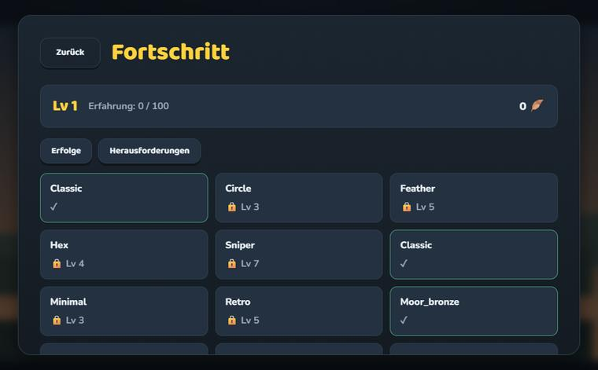
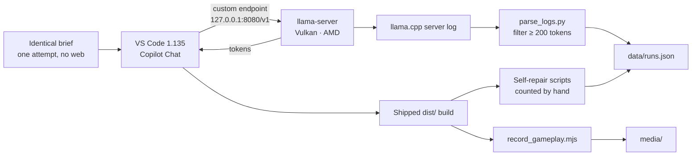

<div align="center">

<h1>Local AI on AMD</h1>

<p>
  <b>A usability benchmark for local LLMs — scored on the software they ship,<br>
  not on the questions they answer.</b>
</p>

<p>
  Six models. Two AMD machines. <b>876,738 tokens</b> of unattended agentic work.<br>
  Every speed number in this repository was parsed out of a <code>llama.cpp</code> server log.
</p>

<p>
  
  
  
  
  <br>
  
  
  
  
  
</p>

<p>
  <a href="#the-leaderboard">Results</a> ·
  <a href="#what-the-models-actually-shipped">Artifacts</a> ·
  <a href="#three-findings-that-contradict-the-model-cards">Findings</a> ·
  <a href="#context-depth-is-the-number-that-matters">Depth</a> ·
  <a href="#the-two-benches">Benches</a> ·
  <a href="#how-this-is-measured">Method</a> ·
  <a href="#the-data">Data</a>
</p>

<br>


<sub><b>Nothing here was written by a human.</b> Qwen3.8-27B UD-Q6_K_M built this 3D scene —
renderer, combat loop, dialogue, UI — in one 88-minute agent session on a €1,500 Radeon.</sub>

</div>

---

> [!NOTE]
> Almost every local-LLM speed figure you have read is `pp512` / `tg128`: a few hundred tokens,
> a cold cache, a quiet machine. A coding agent works at **50,000–180,000 tokens of context for
> hours on end**. Measured side by side, **the lab number is roughly twice what you actually
> get.** This repository publishes the second number.

## Why this exists

I wanted one question answered and could not find it answered anywhere: **can you actually work
with a local model on AMD hardware?** Not "does it score 61 on Terminal-Bench" — can you hand it
a real feature at 4 p.m. and have something that runs by dinner?

So this is not a question set. Each model gets the same brief in **VS Code Copilot Chat**,
pointed at a `llama-server` on the local network, and is then left alone for hours. What it
ships is a playable build. What the server log records is what it cost.

Three things get measured here that no leaderboard reports:

| | |
|---|---|
| **Agentic throughput** | The median decode rate across hundreds of *real* responses, not a synthetic burst. |
| **Self-repairs** | How many times a model had to patch its own broken code before it worked. This is the number that decides whether you want to work with a model. |
| **Depth decay** | Throughput at the context depth agents actually live at, not at 512 tokens. |

---

## The leaderboard

Decode median over every logged response of **200 tokens or more**, taken from the `llama.cpp`
server log. The floor matters: without it the Qwen3.6 log contributes entries reading
1,000,000 t/s, because a single token happened to be emitted in ~0 ms.

| Model | Quant | Bench | Task | n | Decode median | | p10 – p90 | Peak | Tokens | Wall clock |
|---|---|---|---|--:|--:|---|---|--:|--:|--:|
| **Qwen3.8-27B** | UD-Q4_K_XL | R9700 | Moorhuhn | 82 | **33.69** t/s | `████████████` | 27.8 – 45.3 | 84.9 | 332,405 | 160 min |
| **Qwen3.6-27B** | UD-Q6_K_XL | R9700 | Moorhuhn | 221 | **33.45** t/s | `████████████` | 29.0 – 38.3 | 41.4 | 175,743 | 88 min |
| **Qwen3.8-27B** | UD-Q6_K_M | R9700 | Clair Obscur | 30 | **26.30** t/s | `█████████▌` | 17.8 – 34.3 | 42.4 | 118,919 | 88 min |
| **Qwen3.8-Flash-Next** | UD-Q4_K_XL | Evo X2 | Moorhuhn | 42 | **23.84** t/s | `████████▌` | 18.9 – 27.4 | 33.9 | 98,871 | 75 min |
| **DeepSeek-V4-Flash-0731** | UD-IQ3_XXS | Evo X2 | Clair Obscur | 98 | **7.02** t/s | `██▌` | 5.0 – 9.8 | 10.8 | 150,800 | 303 min |

<sub><b>Moorhuhn</b> — a 2D arcade shooter; the German equivalent of "build Flappy Bird from
scratch". <b>Clair Obscur</b> — a 3D action-RPG scene with a renderer, combat and dialogue. Both
briefs are open-ended: the model picks the engine, the art direction and the scope.</sub>

Two models have only been measured synthetically so far, and are kept in a separate class on
purpose:

| Model | Quant | Bench | Prefill (pp512) | Decode (tuned) | Draft acceptance |
|---|---|---|--:|--:|--:|
| Qwen3.5-122B-A10B | UD-Q4_K_XL | Evo X2 | 245.7 t/s | 31.80 t/s | **0.866** |
| Laguna S 2.1 · 118B-A8B | Q4_K_M | Evo X2 | 309.6 t/s | 27.90 t/s | 0.53 |

> [!WARNING]
> **Do not sort those two tables together.** Where both measurement styles exist for the same
> model, the synthetic figure came out at roughly **2× the agentic one** (Qwen3.8-Flash-Next:
> 22.14 t/s in the lab against 10.98 t/s in the agent run, on the version measured in August).
> A benchmark that mixes the two is not measuring anything.

---

## What the models actually shipped

Every clip below is the model's own build, recorded from the shipped `dist/` — no edits, no
human touch-ups, no cherry-picked frames.

<table>
<tr>
<td width="50%" valign="top">

<b>Clair Obscur</b> — Qwen3.6-27B UD-Q6_K_XL · R9700<br>
<sub>Third-person 3D exploration with volumetric fog, physics colliders and combat markers.</sub>
</td>
<td width="50%" valign="top">

<b>Moorhuhn</b> — Qwen3.6-27B UD-Q6_K_XL · R9700<br>
<sub>Parallax layers, scoring, ammo and a round timer. Also <b>15 self-repair scripts</b> — see below.</sub>
</td>
</tr>
<tr>
<td width="50%" valign="top">

<b>Moorhuhn</b> — Sonnet 5 · cloud reference<br>
<sub>The control group. Same brief, a frontier model, so the local results have a ceiling to be
read against.</sub>
</td>
<td width="50%" valign="top">

<b>Moorhuhn</b> — Qwen3.8-27B UD-Q4_K_XL · R9700<br>
<sub><b>A still, because this build does not run.</b> "Start game" does nothing across five
attempts while the sub-menus work fine. The fastest run in the field shipped the broken
artifact.</sub>
</td>
</tr>
</table>

> [!IMPORTANT]
> That last tile is the whole point of the project. The model with the **highest decode median
> in the entire field** produced a build that does not start. Throughput is not usability, and a
> benchmark that only publishes t/s will tell you the opposite.

### Self-repairs: the metric nobody reports

Left alone, a model does not fail cleanly — it writes another patch script. The project folder
of the Qwen3.6-27B Moorhuhn run contains fifteen of them:

```
fix_hit.cjs            fix_coords_final.cjs      fix_hitbox_big.cjs
fix_coords_proper.cjs  fix_hit_v2.cjs            … 10 more
```

Fifteen attempts at one hit test. Across the four runs where they were counted, **37 self-repair
scripts** were left behind. None of that shows up in a decode median, and it is exactly what you
feel when you work with a model all afternoon.

---

## Three findings that contradict the model cards

These took weeks to find. They are the reason this repository is worth more than its tables.

### 1. The documented speculation depth destroys throughput

Laguna S 2.1's model card recommends `--spec-draft-n-max 15`. On bandwidth-bound hardware that
is a **2.5× collapse** — below the rate you get with no speculation at all:

| Setting | Decode | vs. no speculation |
|---|--:|--:|
| `--spec-draft-n-max 15` *(as documented)* | 8.10 t/s | **0.39×** |
| speculation off | 20.55 t/s | 1.00× |
| `--spec-draft-n-max 3` *(measured optimum)* | **27.90 t/s** | **1.36×** |

Qwen3.5-122B-A10B is the same story with a smaller blast radius: Unsloth's example value of `6`
sits 13 % below the optimum at `2`. **The optimum is sharp** — it is worth sweeping on your own
machine rather than trusting the card.

### 2. Both published sampling presets are wrong for thinking-mode coding

Unsloth's "precise coding" preset ships `presence_penalty 0.0`. On one task it generated
**32,768 tokens and never terminated** — a task Laguna solves in **201 tokens**. What works is a
mix no published preset offers: **coding temperature 0.6 with `presence_penalty 1.5`**.

### 3. Reserving more VRAM on unified memory buys nothing

Enlarging the BIOS UMA reservation on the Ryzen AI Max+ 395 did not improve throughput, and
would have starved the OS. Even at a 262,144-token context the GPU peaked at **86.09 GiB with
25.56 GiB still free**. Memory is not what limits this machine. Time is.

<details>
<summary><b>Bonus finding — where the depth decay actually comes from</b></summary>

<br>

On the R9700, roughly **four fifths of the throughput lost to context depth traces back to
speculation collapsing**, not to memory bandwidth or attention cost. Decode rate correlates with
mean accepted draft length at **r = +0.804**, against **r = +0.464** for raw draft acceptance.

The practical consequence: at deep context you are not fighting physics, you are fighting a
draft model that has stopped guessing well — a tunable problem, not a hardware ceiling.

</details>

---

## Context depth is the number that matters

Peak t/s is measured on an empty context. Agents never work on an empty context.

**Prefill vs. depth** — Radeon AI PRO R9700, Qwen3.8-27B UD-Q6, build `bd9bd1b`, sampled across
a single 180,396-token task:

| Depth | 8 K | 16 K | 34 K | 67 K | 100 K | 132 K | 164 K |
|---|--:|--:|--:|--:|--:|--:|--:|
| Prefill | **498.3** | 423.1 | 323.0 | 223.3 | 172.4 | 139.6 | **118.0** t/s |
| | `█` | `▇` | `▅` | `▃` | `▂` | `▁` | `▁` |

A **4.2× fall**. That one 180,396-token prompt took **16.6 minutes before the first character
came back**.

**Decode vs. depth** — Ryzen AI Max+ 395, Qwen3.8-Flash-Next UD-Q4_K_XL, build `580e88d`
(measured on the August build; the current release is more than twice as fast at shallow depth):

| Context | 512 | 1 K | 2 K | 4 K | 16 K | 32 K | 64 K | 128 K | 164 K |
|---|--:|--:|--:|--:|--:|--:|--:|--:|--:|
| Decode | 22.14 | **22.50** | 21.99 | 21.66 | 19.04 | 16.65 | 12.25 | 8.84 | **7.70** t/s |
| Retained | 100 % | 102 % | 99 % | 98 % | 86 % | 75 % | 55 % | 40 % | **35 %** |
| | `█` | `█` | `█` | `█` | `▆` | `▅` | `▃` | `▂` | `▁` |

Two thirds of your throughput is gone by the time an agent has finished reading your codebase.
**Depth behaviour, not peak throughput, decides whether a model is usable.**

---

## The two benches

<table>
<tr>
<th width="50%">Radeon AI PRO R9700</th>
<th width="50%">Ecotech Evo X2 · Ryzen AI Max+ 395</th>
</tr>
<tr valign="top">
<td>

`gfx1201` · RDNA4 · **32 GB dedicated**

| | |
|---|---|
| Allocatable | 32,624 MiB |
| CPU | Intel Core Ultra 7 265KF |
| System RAM | 63.6 GiB |
| Board | ASUS PRIME Z890-P WIFI · BIOS 2401 |
| Driver | Adrenalin 26.6.4 |
| Vulkan ICD | `amdvlk64` 9.2.10.395 |
| OS | Windows 11 Pro 26200 |
| Note | Headless; an RTX 5080 drives the desktop |
| Street price | from ~€1,500 |

</td>
<td>

`gfx1151` · Strix Halo · Radeon 8060S · **128 GiB unified**

| | |
|---|---|
| Memory | 128 GiB LPDDR5X-8533, 8 channels |
| Bandwidth | ~256 GB/s theoretical |
| Visible to Windows | 63.6 GiB |
| UMA reservation | 64.4 GiB |
| Vulkan heap | 98,123 MiB · 93,217 MiB free |
| Driver | 32.0.31021.5001 |
| Vulkan SDK | 1.4.350.0 (LunarG) |
| OS | Windows 11 Pro 26200 |
| Street price | from ~€1,800 |

</td>
</tr>
</table>

> [!CAUTION]
> **The Ryzen AI Max+ 395 does not have 128 GB of VRAM.** It has 128 GiB of *unified* LPDDR5X.
> Windows reports 63.6 GiB, the BIOS reservation is 64.4 GiB, and Vulkan advertises a
> 98,123 MiB heap. Quote any one of those figures on its own and you are saying something false
> — which is why `data/hardware.json` carries all of them.

Both machines run **llama.cpp on the Vulkan backend**. No ROCm, no BIOS tinkering, no enlarged
memory reservation. Builds in play: `b10717`, `bd9bd1b` (TheTom fork), `b9985`, `580e88d`
(qwen4exp), `04b2b72` (poolside).

---

## Vision benchmark

Two images that are provably in nobody's training set, because they were made for this.

<div align="center">

</div>

**Image A — dashboard.** A comparison tooltip carrying 4 × 2 figures, three KPI tiles, active
filter chips, series labels, axis labels and footnotes across five type sizes. Two tasks:
*extract* it to JSON, then *rebuild* the line chart as standalone SVG. Only what is visible in
the image is scored — never anything a model could answer from world knowledge, or you are
measuring memory instead of perception.

**Image B — convention stand.** 40+ objects, dual-currency price tags, occlusion, glare. Scored
as precision / recall / hallucination rate over `{name, gbp, eur}`. One tag lists the currencies
in reversed order as a deliberate trap.

> [!NOTE]
> **Image B is deliberately not in this repository.** People are recognisable in it, and
> automatic face blurring fails at the size those faces occupy. It ships once the faces have been
> redacted by hand. Both images are pinned by SHA-256 before any model sees them, so it stays
> provable that every model was shown the same pixels.

---

## How this is measured



The rules that keep the comparison honest:

- **Identical prompt bytes** for every model, **one attempt**, **no web access**. A model that
  gets lucky searching is not a better model.
- **Speed comes from the log, never from a benchmark harness.** Medians over real responses.
- **The ≥ 200 token floor is mandatory** and is stated everywhere it applies.
- **Failures ship.** A build that does not start is published as a build that does not start.
- **Provenance beats plausibility.** See the correction below.

<details>
<summary><b>A correction worth reading — how a 5.6× error got into this data</b></summary>

<br>

An earlier draft listed **35.73 t/s** for DeepSeek-V4-Flash-0731. That figure came from the
comment header of `start-deepseek-v4-flash-0731-DSPARK.bat`, where it is explicitly labelled as
a *third-party published Strix Halo run with greedy sampling*. It was never measured here.

The figure from the actual agent log is **7.02 t/s** — **5.6× lower**.

The lesson, now a rule for this repository: **numbers from script comments, model cards and
README tables are never adopted without verification. Only logs and measurement protocols
count.**

</details>

---

## The data

```
data/runs.json        11 runs — decode, prefill, percentiles, tokens, self-repairs,
                      the full llama-server command line, media references
data/configs.json     19 complete llama-server launch configurations from the .bat files
data/hardware.json    both benches, every memory figure, drivers, Vulkan versions
docs/                 raw values, sources, and an explicit list of what is still missing
scripts/parse_logs.py         the log parser behind every speed number here
scripts/record_gameplay.mjs   headless capture of the shipped builds
media/                recordings, stills, vision reference image
```

Each run in `data/runs.json` carries its own launch line verbatim, so a result and the
configuration that produced it can never drift apart:

```jsonc
{
  "slug": "qwen38-27b-q4xl-moorhuhn-r9700",
  "model": "Qwen3.8-27B", "quant": "UD-Q4_K_XL", "hw": "r9700",
  "kind": "agent",
  "decode":  { "median": 33.69, "p10": 27.83, "p90": 45.31, "peak": 84.92, "n": 82 },
  "prefill": { "median": 266.9, "max": 499.5 },
  "tokens": 332405, "minutes": 160, "fixes": 4,
  "spec": "draft-mtp + ngram-mod 24/48/64 · n_max 2",
  "build": "b10717", "ctx": 262144, "kv": "q8_0 / q8_0", "ub": 288,
  "cmd": "llama-server -m Qwen3.8-27B-UD-Q4_K_XL.gguf …",
  "source": "llama.cpp server log · 82 responses ≥ 200 tokens"
}
```

### Run the parser yourself

```bash
git clone https://github.com/KaiFelixBennett/local-ai-amd-benchmark
cd local-ai-amd-benchmark
python scripts/parse_logs.py        # point the paths at your own llama.cpp logs
```

It reports prefill and decode medians with percentiles per log. Point it at one of your own runs
and the output drops straight into the `data/runs.json` shape.

> [!TIP]
> The point of this repository is **not** that you re-run the benchmark. It is that you copy the
> launch line for your hardware out of `data/configs.json` and get the same performance in your
> own editor this afternoon.

---

## What is missing

Stated plainly, because a benchmark that hides its gaps is marketing.

| Gap | Affects | Status |
|---|---|---|
| **Quality rubric scores** | every run | Provisional throughout. The quality axis is not yet defensible and is marked as such wherever it appears. |
| **Energy measurement** | both benches | Wh per 1,000 tokens is the strongest figure against a cloud API — and it is missing. Needs a wall meter or `amdsmi` sampling. |
| **Cloud reference runs** | Opus 5, GPT 5.6, Sonnet 5 | Prompts exist; the runs are outstanding. |
| **One identical quant on both machines** | hardware comparison | Without it there is no true head-to-head, only two separate lists. |
| **Prefill for DeepSeek-V4-Flash** | Evo X2 | Open. |
| **Vision reference image B** | vision benchmark | Withheld until the faces are redacted by hand. |
| **Sixth agent run** | Qwen3.6-27B · Clair Obscur | Artifact shipped, log not yet parsed. |

---

## Related projects

| | |
|---|---|
| [**llama-cpp-turboquant**](https://github.com/KaiFelixBennett/llama-cpp-turboquant) | llama.cpp fork with a TurboQuant KV cache — the `bd9bd1b` build used above |
| [**gemma4-turboquant-rdna4**](https://github.com/KaiFelixBennett/gemma4-turboquant-rdna4) | Gemma-4-31B at 256 K context on RDNA4 |
| [**hermes-claude-code-local**](https://github.com/KaiFelixBennett/hermes-claude-code-local) | Hermes Agent and Claude Code running locally against llama.cpp |
| [**RadeonForge**](https://github.com/KaiFelixBennett/RadeonForge) | QLoRA fine-tuning on Radeon via ROCm |

---

## License & citation

**Code MIT · measurement data CC-BY-4.0.** Quote the numbers, and please quote them with their
measurement style — agentic or synthetic — attached.

```bibtex
@misc{localaiamd2026,
  title        = {Local AI on AMD: a usability benchmark for local LLMs
                  on consumer AMD hardware},
  author       = {Bennett, Kai Felix},
  year         = {2026},
  howpublished = {\url{https://github.com/KaiFelixBennett/local-ai-amd-benchmark}}
}
```

<div align="center">
<br>
<sub>Measured on hardware that fits under a desk · <a href="https://securesight.ai">securesight.ai</a></sub>
</div>
