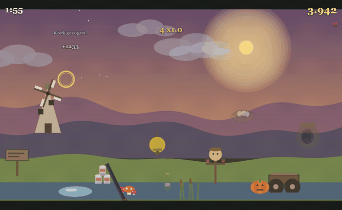

<div align="center">

<h1>Local AI on AMD</h1>

<p>
  <b>A usability benchmark for local LLMs — scored on the software they ship,<br>
  not on the questions they answer.</b>
</p>

<p>
  Nine models. Two AMD machines. <b>1,835,623 tokens</b> of unattended agentic work.<br>
  Every number below is re-derived from a raw <code>llama.cpp</code> server log that ships
  in this repository.
</p>

<p>
  
  
  
  <br>
  
  
  
</p>

<p>
  <a href="#start-here">Start here</a> ·
  <a href="#measured-throughput">Results</a> ·
  <a href="#what-the-models-actually-shipped">Artifacts</a> ·
  <a href="#five-findings-that-contradict-the-model-cards">Findings</a> ·
  <a href="#context-depth-is-the-number-that-matters">Depth</a> ·
  <a href="#verify-every-number">Evidence</a> ·
  <a href="#faq">FAQ</a>
</p>

<br>



<sub><b>No human wrote a line of this.</b> Qwen3.8-Flash-Next at Q4 built
<i>Moorland Mayhem — Featherstorm</i> in <b>one prompt and 13 h 35 min</b>, unattended, on a
€1,800 mini-PC: <b>55 files, 10,531 lines of source and 1,398 lines of tests</b>, across 459
requests, and the context was never once truncated.
<a href="evidence/logs/qwen38-flashnext-moorhuhn-evox2.log">Its 1.9 MB server log is in this
repo.</a></sub>

</div>

---

> [!NOTE]
> Almost every local-LLM speed figure you have read is `pp512` / `tg128`: a few hundred tokens,
> a cold cache, a quiet machine. A coding agent works at **27,000–180,000 tokens of context for
> hours on end**. Measured side by side on the same machine, **the lab number is roughly twice
> what you actually get.** This repository publishes the second number — and ships the logs it
> came from.

## Start here

Three things you can take away today, in descending order of how much time they save you.

| | |
|---|---|
| **1. Copy a launch line that is known to work** | [`data/configs.json`](data/configs.json) holds **19 complete `llama-server` configurations** — every flag, for both machines, exactly as measured. Not a tutorial; the actual command lines. |
| **2. Skip three settings mistakes** | Two published presets and one piece of vendor guidance are wrong for agentic coding on this hardware. [Findings](#five-findings-that-contradict-the-model-cards) — each with the protocol behind it. |
| **3. Plan for the number that matters** | Peak t/s is measured on an empty context. [Throughput at depth](#context-depth-is-the-number-that-matters) is what an agent actually gets, and it is a third of the headline. |

**The fastest useful thing in this repo** — the exact line behind the run at the top of this page:

```bash
llama-server -m Qwen3.8-Flash-Next-UD-Q4_K_XL-00001-of-00004.gguf \
  --mmproj mmproj-F16.gguf --alias qwen3.8-flash-next \
  --host 127.0.0.1 --port 8099 --device Vulkan0 \
  --gpu-layers all --n-cpu-moe 0 --fit off -fa on \
  --load-mode mmap --lazy-mode on \
  --ctx-size 262144 --parallel 1 --kv-unified \
  -ctk q8_0 -ctv q8_0 -b 2048 -ub 512 \
  --ctx-checkpoints 4 --checkpoint-min-step 4096 \
  --jinja --reasoning on --reasoning-format deepseek --reasoning-effort xhigh
```

<sub>Ryzen AI Max+ 395 · llama.cpp build <code>580e88d</code> · MTP speculation, shared-Q8_0,
<code>n_max 2</code>. Point VS Code Copilot Chat at <code>http://127.0.0.1:8099/v1</code> as a
custom endpoint and you have the setup that produced the build above.</sub>

**And to check that this repository is not lying to you:**

```bash
git clone https://github.com/KaiFelixBennett/local-ai-amd-benchmark
cd local-ai-amd-benchmark
cd evidence && sha256sum -c SHA256SUMS && cd ..   # the raw files are the ones cited
python scripts/parse_logs.py                      # re-derive every published figure
```

No dependencies beyond Python 3. It prints the tables below and checks every log against its
checksum as it goes.

---

## Why this exists

I wanted one question answered and could not find it answered anywhere: **can you actually work
with a local model on AMD hardware?** Not "does it score 61 on Terminal-Bench" — can you hand it
a real feature at 4 p.m. and have something that runs by dinner?

So this is not a question set. Each model gets the same brief in **VS Code Copilot Chat**,
pointed at a `llama-server` on the local network, and is then left alone for hours. What it
ships is a playable build. What the server log records is what it cost.

Four things get measured here that no leaderboard reports:

| | |
|---|---|
| **Agentic throughput** | The median decode rate across hundreds of *real* responses, not a synthetic burst. |
| **Self-repairs** | How many times a model had to patch its own broken code before it worked. This is the number that decides whether you want to work with a model. |
| **Depth decay** | Throughput at the context depth agents actually live at, not at 512 tokens. |
| **Wall clock vs. GPU time** | How much of an unattended afternoon the GPU is actually busy. The answer surprised me — see [below](#an-agent-run-has-no-idle-time). |

---

## Measured throughput

<div align="center">
<picture>
  <source media="(prefers-color-scheme: dark)" srcset="media/chart/field-dark.svg">
  
</picture>
</div>

> [!IMPORTANT]
> **There is no overall ranking here, and the tables below are not one.** Any weighting of
> speed against quality is an opinion, so this repository does not publish a total score.
> Decode t/s is a property of **model size, memory bandwidth and speculation settings** — not
> of how good a model is. Read the chart for the trade-off; read the tables for the numbers.

Three things the chart says that a speed-ordered column cannot:

- **Fast does not mean good.** Qwen3.6-27B Q6 is among the fastest runs in the field and the
  *weakest* Qwen on the quality axis — 14, with 15 self-repairs.
- **The slowest agent run on the Moorhuhn brief scored joint-highest on it.** Qwen3.8-Flash-Next
  is level with the fastest run on quality at **two thirds of its decode rate**, and it is the
  only model scoring the same on both briefs. Its low t/s is a memory-system result: ~177 B of
  weights, ~6 B active, reached over ~256 GB/s of unified LPDDR5X with MoE routing moving the
  working set every token. That is not a capability measurement.
- **The highest local quality score in the dataset sits on the AI MAX 395** — Qwen3.5-122B-A10B
  at 18, above every R9700 run — and it only has a synthetic sweep, so no speed-ordered table
  would ever show it.

Only two runs are on the **Pareto front** — beaten by nothing on both axes at once:
Qwen3.8-27B Q6 (26.30 t/s, quality 17) and Qwen3.8-27B Q4_XL (33.69 t/s, quality 16). The run
at the top of this page is not one of them: it ties the best Moorhuhn quality score but is
slower, and on a chart that is a trade-off, not a defeat. It is here first because a thirteen
and a half hour single-prompt build is the thing this repository exists to show.

Tables are grouped by task, because Moorhuhn and Clair Obscur are different briefs and rows
across them are not comparable. **The log behind every row is one click below each table.**

### Moorhuhn — 2D arcade shooter

| Model | t/s | Qual † | Rep. | Wall<br>min |
|---|--:|--:|--:|--:|
| **Qwen3.8**<br>**Flash‑Next** | **21.76** | 16 | — | **815** |
| **Qwen3.8‑27B** | **33.69** | 16 | **4** | 540 ‡ |
| **Qwen3.6‑27B** | **33.45** | **14** | **15** | 153 |
| Sonnet 5 *(cloud)* | — | 17 | 2 | 70 |

<details>
<summary>Quantisation, machine, sample size, tokens and GPU time per run</summary>

<br>

| Model | Quant | Machine | n | Tokens | GPU | Log |
|---|---|---|--:|--:|--:|:-:|
| Qwen3.8-Flash-Next | UD-Q4_K_XL | AI MAX 395 | **346** | **770,428** | 799 min | [log](evidence/logs/qwen38-flashnext-moorhuhn-evox2.log) |
| Qwen3.8-27B | UD-Q4_K_XL | R9700 | 82 | 332,405 | 189 min | [log](evidence/logs/qwen38-27b-q4xl-moorhuhn-r9700.log) |
| Qwen3.6-27B | UD-Q6_K_XL | R9700 | 221 | 175,743 | 139 min | [log](evidence/logs/qwen36-27b-q6-moorhuhn-r9700.log) |
| Sonnet 5 | — | cloud | — | — | — | *artifact only* |

</details>

<sub><b>t/s</b> decode median · <b>Qual †</b> provisional quality, 20-point scale, see the
caution below · <b>Rep.</b> self-repair scripts the model left behind · <b>Wall</b> minutes
from the first request to the end of the last.<br>
Percentile spread, decode p10 – p90: Flash-Next 17.15 – 26.28 · Qwen3.8-27B 27.83 – 45.34 ·
Qwen3.6-27B 29.02 – 38.25. Peaks 33.89 / 84.92 / 41.39 t/s.<br>
‡ The Qwen3.8-27B run spans two server sessions totalling 9 h; the published log covers the
first 191 minutes. Its GPU time is for that log only — it is the one row where wall clock and
GPU time are not measured over the same window.</sub>

### Clair Obscur — 3D turn-based RPG

| Model | t/s | Qual † | Rep. | Wall<br>min |
|---|--:|--:|--:|--:|
| **Qwen3.8‑27B** | **26.30** | **17** | 6 | 115 |
| **Qwen3.8**<br>**Flash‑Next** | **10.93** | 16 | — | 370 |
| **DeepSeek‑V4**<br>**Flash‑0731** | **7.02** | **13** | 12 | 502 |
| **Qwen3.6‑27B** | — | 15 | — | — |

<details>
<summary>Quantisation, machine, sample size, tokens and GPU time per run</summary>

<br>

| Model | Quant | Machine | n | Tokens | GPU | Log |
|---|---|---|--:|--:|--:|:-:|
| Qwen3.8-27B | UD-Q6_K_M | R9700 | 30 | 118,919 | 115 min | [log](evidence/logs/qwen38-27b-q6-clairobscur-r9700.log) |
| Qwen3.8-Flash-Next | UD-Q4_K_XL | AI MAX 395 | 92 | 236,460 | 368 min | [log](evidence/logs/qwen38-flashnext-clairobscur-halo.log) |
| DeepSeek-V4-Flash-0731 | UD-IQ3_XXS | AI MAX 395 | 98 | 150,800 | 500 min | [log](evidence/logs/deepseek-v4-flash-clairobscur-halo.log) |
| Qwen3.6-27B | UD-Q6_K_XL | R9700 | — | — | — | *log not parsed* |

</details>

<sub>Percentile spread, decode p10 – p90: Qwen3.8-27B 15.55 – 34.22 · Flash-Next 9.70 – 13.85 ·
DeepSeek 4.85 – 9.89. Peaks 42.39 / 17.01 / 10.83 t/s.<br>
<b>Read the Flash-Next row with its draft model in mind.</b> It ran on an <b>older, weaker MTP
draft model — not the Unsloth one</b> the Moorhuhn run used. Its 10.93 t/s is therefore not this
model's ceiling on this machine, and the gap to the 21.76 t/s Moorhuhn row is a draft-model
result, not a task result. See <a href="#4-a-better-mtp-draft-model-is-worth-about-2-in-real-agent-work">finding 4</a>.</sub>

### Synthetic sweeps — same machine, different measurement style

Kept in the section rather than in a distant side table, because leaving them out is how the
AI MAX 395's quality showing goes missing. They have no agent log, so they carry no `n`, no
token count and no place on the Pareto front.

| Model | Prefill (pp512) | Decode (tuned) | Draft acceptance | Quality † | Report |
|---|--:|--:|--:|--:|:-:|
| **Qwen3.5-122B-A10B**<br><sub>UD-Q4_K_XL · AI MAX 395</sub> | 245.71 t/s | 31.80 t/s | **0.866** | **18** | [report](evidence/reports/qwen35-122b-a10b-strix-halo-vulkan-benchmark.md) |
| **Laguna S 2.1** · 118B-A8B<br><sub>Q4_K_M · AI MAX 395</sub> | 309.64 t/s | 27.90 t/s | 0.559 | 17 | [report](evidence/reports/laguna-s21-strix-halo-vulkan-benchmark.md) |

> [!WARNING]
> **Do not read those two rows against the agentic ones.** Where both measurement styles exist
> for the same model, the synthetic figure ran about **2× the agentic one**. The quality column
> is comparable across all three tables; the speed column is not.

> [!CAUTION]
> **† Quality is provisional and it is the weakest thing on this page.** Human-assigned on a
> 20-point scale, no published protocol, and the whole local field lands between 13 and 18 in
> whole integers — too coarse to separate three runs tied at 16. **Do not sort by it, and do not
> quote it as a result.** Writing the rubric is the first item under
> [what is missing](#what-is-missing); until it exists, the y axis of that chart is an opinion
> with error bars nobody has drawn.

---

## What the models actually shipped

Every clip is the model's own build, recorded from the shipped `dist/` — no edits, no human
touch-ups, no cherry-picked frames. The **full source of every run** is in
[`benchmarks/`](benchmarks/), exactly as the model left it.

<table>
<tr>
<td width="50%" valign="top">

<b>Clair Obscur</b> · Qwen3.8-Flash-Next<br>
<sub>UD-Q4_K_XL · AI MAX 395 · 29 files, 6,157 lines<br>
Four-character party, turn-order panel, enemy nameplates with health bars, an expedition
roster — and a French-language UI it chose on its own.</sub>
</td>
<td width="50%" valign="top">

<b>Clair Obscur</b> · Qwen3.8-27B<br>
<sub>UD-Q6_K_M · R9700 · 36 files, 11,115 lines<br>
Turn-based party combat with an AP economy, boss phases, parry timing and dialogue. Highest
quality score of any agent run.</sub>
</td>
</tr>
<tr>
<td width="50%" valign="top">

<b>Moorhuhn</b> · Qwen3.6-27B<br>
<sub>UD-Q6_K_XL · R9700 · 39 files, 6,903 lines<br>
Parallax layers, scoring, ammo, round timer. Also <b>15 self-repair scripts</b> and
<b>zero tests</b> — see below.</sub>
</td>
<td width="50%" valign="top">

<b>Moorhuhn</b> · Sonnet 5 <i>· cloud reference</i><br>
<sub>72 files, 9,433 lines<br>
The control group. Same brief, a frontier model, so the local results have a ceiling to be
read against.</sub>
</td>
</tr>
<tr>
<td width="50%" valign="top">

<b>Clair Obscur</b> · Qwen3.6-27B<br>
<sub>UD-Q6_K_XL · R9700 · 26 files, 8,705 lines<br>
Third-person exploration with volumetric fog, physics colliders and combat markers. The
artifact exists; its log is not parsed yet.</sub>
</td>
<td width="50%" valign="top">

<b>Clair Obscur</b> · Laguna S 2.1<br>
<sub>Q4_K_M · AI MAX 395 · 21 files, 5,994 lines<br>
From the coding evaluation in its report. No agent-log run yet, so it appears only in the
synthetic table.</sub>
</td>
</tr>
</table>

> [!IMPORTANT]
> **The cleanest experiment in this dataset is the Qwen3.8-27B Moorhuhn run against the
> Qwen3.6-27B one.** Same task, same machine, decode medians **0.7 % apart** — 33.69 against
> 33.45 t/s. One shipped a game with accessibility options, persistent highscores and five
> game modes after **4** self-repairs and with **11 test files**. The other needed **15**
> self-repairs, shipped **no tests at all**, and scored two rubric points lower. Identical
> throughput, entirely different afternoons. Whatever decode t/s measures, it is not that.

### Self-repairs and tests: the metrics nobody reports

Left alone, a model does not fail cleanly — it writes another patch script. The project folder
of the Qwen3.6-27B Moorhuhn run contains fifteen of them:

```
fix_hit.cjs            fix_coords_final.cjs      fix_hitbox_big.cjs
fix_coords_proper.cjs  fix_hit_v2.cjs            … 10 more
```

Fifteen attempts at one hit test. Across the four runs where they were counted, **37 self-repair
scripts** were left behind — and the two runs with the fewest (4 and 6) produced the two best
artifacts.

Whether a model writes tests at all splits the field just as sharply, and the counts come
straight out of [`benchmarks/`](benchmarks/):

| Run | Files | Lines | Tests | Test lines |
|---|--:|--:|--:|--:|
| Qwen3.8-Flash-Next · Moorhuhn | 55 | 10,531 | **10** | **1,398** |
| Qwen3.8-27B · Moorhuhn | 42 | 10,839 | **11** | **1,257** |
| Sonnet 5 · Moorhuhn *(cloud ref.)* | 72 | 9,433 | **11** | **885** |
| Qwen3.8-27B · Clair Obscur | 36 | 11,115 | 0 | 0 |
| Qwen3.6-27B · Moorhuhn | 39 | 6,903 | 0 | 0 |
| Qwen3.8-Flash-Next · Clair Obscur | 29 | 6,157 | 0 | 0 |
| DeepSeek-V4-Flash · Clair Obscur | 24 | 3,901 | 0 | 0 |

None of that shows up in a decode median, and it is exactly what you feel when you work with a
model all afternoon.

---

## An agent run has no idle time

This one I did not expect, and it is the strongest argument in the repository for buying
hardware rather than renting tokens.

An unattended agent run *feels* like it should be full of idle time — the model thinking, the
editor waiting, a human occasionally looking over. It is not. Measuring the wall clock from the
first request to the end of the last, minus every idle gap over 60 seconds, against the GPU time
the log itself reports:

| Run | Wall | GPU busy | Share |
|---|--:|--:|--:|
| Qwen3.8-Flash-Next · Moorhuhn | 815 min | 799 min | **98 %** |
| Qwen3.8-Flash-Next · Clair Obscur | 370 min | 368 min | **99 %** |
| DeepSeek-V4-Flash · Clair Obscur | 502 min | 500 min | **100 %** |
| Qwen3.8-27B · Clair Obscur | 115 min | 115 min | **100 %** |
| Qwen3.6-27B · Moorhuhn | 153 min | 139 min | **91 %** |

The machine is not waiting for you. It is the bottleneck, from the first request to the last —
which also means an idle-priced cloud comparison is the wrong comparison, and that every
percent of throughput you tune back is a percent off the wall clock.

<sub>Wall clock is measured from the first `launch_slot_` to the last `eval time` line, minus
every gap over 60 s between the end of one response and the start of the next task. Idle
measured between arbitrary log lines would count a slow model's own generation as a pause —
DeepSeek at 7 t/s would show 63 phantom "breaks".</sub>

---

## Five findings that contradict the model cards

These took weeks to find, and each one links to the protocol it came from. They are the reason
this repository is worth more than its tables.

### 1. The documented speculation depth destroys throughput

Laguna S 2.1's model card recommends `--spec-draft-n-max 15`. On bandwidth-bound hardware that
is a **2.5× collapse** — well below the rate you get with no speculation at all:

| Setting | Decode | Draft acceptance | vs. no speculation |
|---|--:|--:|--:|
| `--spec-draft-n-max 15` *(model card default)* | 8.1 t/s | 0.150 | **0.40×** |
| speculation off | 20.4 t/s | — | 1.00× |
| `--spec-draft-n-max 3` *(measured optimum)* | **27.9 t/s** | 0.559 | **1.36×** |

Deeper drafting barely raises mean accepted length (2.29 → 3.24) while acceptance *ratio*
collapses (0.645 → 0.150) — you pay linearly more draft cost for almost no extra accepted
tokens. Qwen3.5-122B-A10B is the same story with a smaller blast radius: against a 20.55 t/s
baseline, the optimum at `n_max 2` reaches 31.80 t/s while Unsloth's example value of `6` gets
27.68 — **13 % below**. **The optimum is sharp**; sweep it on your own machine.

<sub>Sources: [Laguna report §5.3, §6.2](evidence/reports/laguna-s21-strix-halo-vulkan-benchmark.md) ·
[Qwen3.5 report §5.3](evidence/reports/qwen35-122b-a10b-strix-halo-vulkan-benchmark.md)</sub>

### 2. Both published sampling presets are wrong for thinking-mode coding

Unsloth's "precise coding" preset ships `presence_penalty 0.0`, `min_p 0.0` and
`repetition_penalty 1.0` together — safe for instruct mode, unbounded in thinking mode. On an
identical task, varying only the sampling:

| Config | temp | presence | repeat | min_p | Tokens | Wall | Result |
|---|--:|--:|--:|--:|--:|--:|---|
| **A** *(Unsloth "precise coding")* | 0.6 | **0.0** | 1.0 | 0.0 | **32,768** | 1,087 s | **FAIL** · `length` |
| **B** *(adopted)* | 0.6 | **1.5** | 1.0 | 0.0 | **7,680** | **297 s** | **PASS** · `stop` |
| **C** | 0.6 | 0.0 | **1.05** | **0.05** | 8,453 | 333 s | PASS · `stop` |
| **D** | **1.0** | 1.5 | 1.0 | 0.0 | 12,456 | 540 s | PASS · `stop` |

Config A never terminated — it ran to the context ceiling. **Any** anti-repetition mechanism
prevents the runaway; having none engaged causes it. What works is a mix no published preset
offers: **temperature 0.6 with `presence_penalty 1.5`**.

<sub>Source: [Qwen3.5 report §5.4](evidence/reports/qwen35-122b-a10b-strix-halo-vulkan-benchmark.md)</sub>

### 3. Reserving more VRAM on unified memory buys nothing

Enlarging the BIOS UMA carve-out on the Ryzen AI Max+ 395 does not help, and costs you the OS.
Dedicated VRAM and GTT are the *same* LPDDR5X-8533 on this silicon — the carve-out is an
address-space reservation, not distinct memory, so there is no bandwidth to recover. Decode held
at 20.4–20.7 t/s (±1.5 %) across all tasks even though this MoE moves its working set between
both regions every token; a real GTT penalty would show up as variance. Even at a 262,144-token
context the GPU peaked at **86.09 GiB with 25.56 GiB still free**. Published Strix Halo tuning
guidance goes the *other* way and shrinks the carve-out to its 512 MB minimum.

Memory is not what limits this machine. Time is.

<sub>Source: [Laguna report §6.3](evidence/reports/laguna-s21-strix-halo-vulkan-benchmark.md)</sub>

### 4. A better MTP draft model is worth about 2× in real agent work

The two Qwen3.8-Flash-Next runs are the same model and quant on the same machine. What changed
between them is the **draft model**: the September run used Unsloth's MTP shared-Q8_0 head, the
August run an **older and weaker MTP build**.

| Run | Draft model | Context | Decode median | Log |
|---|---|--:|--:|:-:|
| Moorhuhn, September | **Unsloth MTP shared-Q8_0, `n_max 2`** | 131,072 | **21.76** t/s | [log](evidence/logs/qwen38-flashnext-moorhuhn-evox2.log) |
| Clair Obscur, August | older MTP build | 262,144 | **10.93** t/s | [log](evidence/logs/qwen38-flashnext-clairobscur-halo.log) |

That is **1.99×** — landing inside the **1.84–2.13×** range the September run's own log header
records for its MTP measured in isolation. The interesting part is that a lab figure survived
contact with a thirteen-hour agent session, which is not true of raw throughput.

**Swapping the draft head is the cheapest 2× on this page.** It costs one file and one flag, no
new hardware and no quality trade-off, and the acceptance telemetry is right there in the log to
tell you whether yours is working: the September run averages **0.71 acceptance at mean length
2.42** over 459 responses.

> [!CAUTION]
> **This is corroboration, not a clean A/B, and one side of it is not in the log.** The two runs
> also differ in task, context size and reasoning budget. And the August log records no draft
> model being loaded and carries none of the 459 `draft acceptance` lines the September log has —
> which build of MTP it ran is the operator's record, not the log's. Read the 1.99× as agreement
> between two measurements taken months apart, not as an isolated effect.

### 5. A local 27B read the chart better than the frontier model

Two images made for this benchmark, so they are provably in nobody's training set. Task A1 is
pure extraction: read 50 specified values out of a dense analytics dashboard — tooltip figures,
KPI tiles, filter chips, axis labels, footnotes — and emit JSON. Only what is visible in the
image is scored, never anything a model could answer from world knowledge.

| Model | Runs on | A1 · correct | |
|---|---|--:|---|
| **Qwen3.6-27B** UD-Q6_K_XL | R9700, local | **50 / 50 · 100 %** | `████████████` |
| Sonnet 5 | cloud | 46 / 50 · 92 % | `███████████` |
| Qwen3.8-27B UD-Q4_K_XL | R9700, local | 44 / 50 · 88 % | `██████████▌` |

The model that scored *worst* on shipping software read the dashboard *best*, and beat a
frontier cloud model doing it. Chart-reading and code-shipping are not the same ability, and a
single leaderboard number hides that completely.

<sub>Model answers: [`evidence/vision/`](evidence/vision/). The scoring keys stay unpublished on
purpose — publishing them would burn the benchmark for every future model. Image B, a convention
stand with 40+ price tags, is withheld until the recognisable faces in it are redacted by
hand.</sub>

<details>
<summary><b>Bonus finding — where the depth decay actually comes from</b></summary>

<br>

On the R9700, roughly **four fifths of the throughput lost to context depth traces back to
speculation collapsing**, not to memory bandwidth or attention cost. Decode rate correlates with
mean accepted draft length at **r = +0.804**, against **r = +0.464** for raw draft acceptance.

The practical consequence: at deep context you are not fighting physics, you are fighting a
draft model that has stopped guessing well — a tunable problem, not a hardware ceiling.

<sub>Source: [R9700 quant evaluation](evidence/reports/qwen38-27b-rdna4-quant-eval.md), section
"Spekulation: mean len schlägt Akzeptanz"</sub>

</details>

---

## Context depth is the number that matters

Peak t/s is measured on an empty context. Agents never work on an empty context.

**Prefill vs. depth** — Radeon AI PRO R9700, Qwen3.8-27B UD-Q6, build `bd9bd1b`, sampled across
a single 180,396-token task:

| Depth | Prefill t/s | |
|---|--:|---|
| 8 K | **498.3** | `████████` |
| 16 K | 423.1 | `██████▌` |
| 34 K | 323.0 | `█████` |
| 67 K | 223.3 | `███▌` |
| 100 K | 172.4 | `██▌` |
| 132 K | 139.6 | `██` |
| 164 K | **118.0** | `█▌` |

A **4.2× fall**. That one 180,396-token prompt took **16.6 minutes before the first character
came back** — and it is the largest prompt in the whole dataset, visible as the biggest
`prompt eval time` entry in
[that run's log](evidence/logs/qwen38-27b-q6-clairobscur-r9700.log).

**Decode vs. depth** — Ryzen AI Max+ 395, Qwen3.8-Flash-Next UD-Q4_K_XL, build `580e88d`:

| Context | Decode t/s | Retained | |
|---|--:|--:|---|
| 512 | 22.14 | 100 % | `████████` |
| 1 K | **22.50** | 102 % | `████████` |
| 2 K | 21.99 | 99 % | `███████▌` |
| 4 K | 21.66 | 98 % | `███████▌` |
| 16 K | 19.04 | 86 % | `██████▌` |
| 32 K | 16.65 | 75 % | `██████` |
| 64 K | 12.25 | 55 % | `████▌` |
| 128 K | 8.84 | 40 % | `███` |
| 164 K | **7.70** | **35 %** | `██▌` |

Two thirds of your throughput is gone by the time an agent has finished reading your codebase.
**Depth behaviour, not peak throughput, decides whether a model is usable.**

<sub>Sources: [prefill curve](evidence/reports/qwen38-27b-rdna4-quant-eval.md) ·
[decode curve](evidence/reports/qwen38-flashnext-depth-curve.md) with raw
[`llama-bench` sweeps](evidence/csv/)</sub>

---

## The two benches

| | **Radeon AI PRO R9700** | **Ryzen AI Max+ 395** |
|---|---|---|
| Silicon | `gfx1201` · RDNA4 | `gfx1151` · Strix Halo<br><sub>Radeon 8060S</sub> |
| Memory | **32 GB dedicated**<br><sub>32,624 MiB allocatable</sub> | **128 GiB unified** LPDDR5X-8533<br><sub>8 channels · ~256 GB/s theoretical</sub> |
| What the OS sees | 63.6 GiB system RAM | 63.6 GiB · UMA reservation 64.4 GiB<br><sub>Vulkan heap 98,123 MiB, 93,217 free</sub> |
| CPU / chassis | Intel Core Ultra 7 265KF<br><sub>ASUS PRIME Z890-P · BIOS 2401</sub> | Ecotech / GMKtec Evo X2 |
| Driver | Adrenalin 26.6.4<br><sub>Vulkan ICD `amdvlk64` 9.2.10.395</sub> | 32.0.31021.5001<br><sub>Vulkan SDK 1.4.350.0 (LunarG)</sub> |
| OS | Windows 11 Pro 26200 | Windows 11 Pro 26200 |
| Note | Headless; an RTX 5080 drives the desktop | — |
| Street price | from ~**€1,500** | from ~**€1,800** |

> [!CAUTION]
> **The Ryzen AI Max+ 395 does not have 128 GB of VRAM.** It has 128 GiB of *unified* LPDDR5X.
> Windows reports 63.6 GiB, the BIOS reservation is 64.4 GiB, and Vulkan advertises a
> 98,123 MiB heap. Quote any one of those figures on its own and you are saying something false
> — which is why `data/hardware.json` carries all of them.

Both machines run **llama.cpp on the Vulkan backend**. No ROCm, no BIOS tinkering, no enlarged
memory reservation. Builds in play: `b10717`, `bd9bd1b` (TheTom fork), `b9985`, `580e88d`
(qwen4exp), `04b2b72` (poolside). Each log's own header records the exact build, context size,
KV type, speculation setting and sampling for that run.

---

## Verify every number

Nothing here is hand-typed. The raw logs ship in [`evidence/`](evidence/), each with a SHA-256,
and the parser that produced every published figure reads *those* files:

```bash
cd evidence && sha256sum -c SHA256SUMS && cd ..   # 22 files, all pinned
python scripts/parse_logs.py                      # re-derive every published figure
python scripts/verify_runs.py                     # cross-check data/runs.json against the logs
```

The two scripts are written independently and must agree; `verify_runs.py` exits non-zero on any
deviation. **If a number in this README disagrees with what the scripts read out of the logs, the
scripts are right.**

Two conventions govern every figure, and both are stated in the scripts' own headers:

1. **Only responses of 200 tokens or more are scored.** Shorter ones produce artefacts up to
   1,000,000 t/s — one token in near-zero milliseconds. The floor applies to *responses only*;
   prompts are never filtered.
2. **Percentiles are nearest-rank**, 1-based: p10 is the `ceil(0.10 · n)`-th value, no
   interpolation. Medians are the classic middle value. Halves round up.

<details>
<summary><b>Corrections — three measurement bugs found and fixed in these scripts</b></summary>

<br>

Every one of these was found by re-deriving the same figures a second way and comparing. They
are listed because a benchmark that silently edits its own numbers is worth nothing.

| Bug | Effect | Fixed |
|---|---|---|
| The 200-token response floor was also applied to **prompts** | Prefill median came out too high in **every run** — 241.47 instead of 234.86 t/s on Qwen3.8-27B Moorhuhn, 174.92 instead of 152.71 on Qwen3.6-27B, 87.22 instead of 77.63 on Flash-Next | `parse_logs.py`, `verify_runs.py` |
| Percentile rank read `floor(f·n)` as a **0-based** index | One rank too high whenever `f·n` is a whole number. With 30 scored responses that is exactly when it bites: Qwen3.8-27B Clair Obscur p10 read **18.03 instead of 15.55**, p90 **35.31 instead of 34.22** | both scripts |
| `SHA256SUMS` still pinned a **replaced** log | The Flash-Next Moorhuhn log had been superseded by a longer run (346 scored responses instead of 98) and the checksum file was never updated | `evidence/SHA256SUMS` |

The corrected values are what this README now shows, and `python scripts/verify_runs.py` reports
zero deviations against them.

</details>

| | |
|---|---|
| [`evidence/`](evidence/) | 22 raw files — six `llama.cpp` server logs, six measurement protocols, ten CSV tables, two vision answer sets |
| [`evidence/README.md`](evidence/README.md) | **Claim-to-source map**: every published figure, and the exact file and section backing it |
| [`evidence/SHA256SUMS`](evidence/SHA256SUMS) | Checksum of all 22 |
| [`scripts/parse_logs.py`](scripts/parse_logs.py) | The parser. `--json` for machine-readable output; pass a path to analyse a log of your own |
| [`scripts/verify_runs.py`](scripts/verify_runs.py) | Cross-checks `data/runs.json` against the same logs, independently of the parser. Both must agree |
| [`scripts/make_chart.py`](scripts/make_chart.py) | Regenerates the field chart from `data/runs.json`, so the picture cannot drift from the data |

The logs are `llama-server` telemetry only — `print_timing` slot lines, load and config output.
They carry no prompt text and no response text, so there was nothing in them to redact.

> [!TIP]
> `evidence/README.md` also lists what is **not** evidence-backed — the quality rubric, the
> self-repair counts, the street prices, and energy, which is not measured at all. A benchmark
> that hides that line is marketing.

---

## The data

```
data/runs.json        12 runs — decode, prefill, percentiles, tokens, self-repairs,
                      wall clock, GPU time, the full llama-server command line, and an
                      `evidence` field naming the log and its SHA-256
data/configs.json     19 complete llama-server launch configurations from the .bat files
data/hardware.json    both benches, every memory figure, drivers, Vulkan versions
benchmarks/          the source code of every run, as the model delivered it
evidence/            the raw logs, reports, CSVs and vision answers behind every number
harness/             the agent instructions each model was given, verbatim
media/               full-length recordings of each shipped build, plus the README's GIFs
scripts/             the parser, the independent cross-check, the chart generator
```

Each run carries its launch line verbatim and a pointer to its own log, so a result, the
configuration that produced it, and the evidence for it can never drift apart:

```jsonc
{
  "slug": "qwen38-flashnext-moorhuhn-evox2",
  "model": "Qwen3.8-Flash-Next", "quant": "UD-Q4_K_XL", "hw": "evox2", "kind": "agent",
  "decode":  { "median": 21.76, "p10": 17.15, "p90": 26.28, "peak": 33.89, "n": 346 },
  "prefill": { "median": 77.63, "max": 184.76 },
  "tokens": 770428, "tokens_all": 786506, "responses_all": 459,
  "wall_minutes": 815, "gpu_minutes": { "decode": 664.5, "prefill": 134.3 },
  "largest_prompt_tokens": 69985,
  "spec": "MTP, Shared-Q8_0, n-max 2",
  "build": "580e88d", "ctx": 262144, "kv": "q8_0 / q8_0", "ub": 512,
  "cmd": "llama-server -m Qwen3.8-Flash-Next-UD-Q4_K_XL-00001-of-00004.gguf …",
  "evidence": {
    "log": "evidence/logs/qwen38-flashnext-moorhuhn-evox2.log",
    "sha256": "317185ea5ee4760c7f2e838c7feed8cf05b793969cab8679c2ceedb893d71eba",
    "antworten_gesamt": 459, "gewertet": 346
  }
}
```

> [!TIP]
> The point of this repository is **not** that you re-run the benchmark. It is that you copy the
> launch line for your hardware out of `data/configs.json` and get the same performance in your
> own editor this afternoon.

### The code the models wrote

[`benchmarks/`](benchmarks/) holds the full source of every run, sorted by model and then by
run, exactly as the model delivered it — nothing tidied up, nothing corrected afterwards. The
guide in that folder says what is missing from each and why. It is the only place in this
project where you can read what a "quality 14" run actually looks like next to a "quality 17"
one.

---

## FAQ

<details>
<summary><b>Why not just quote tokens per second like everyone else?</b></summary>

<br>

Because the two runs at the top of the Moorhuhn table are **0.7 % apart on decode t/s** and
produced completely different afternoons — one needed 4 self-repairs and wrote 11 test files,
the other needed 15 and wrote none. Decode t/s is a property of model size, memory bandwidth and
speculation settings. It does not predict whether you will get working software.

</details>

<details>
<summary><b>Is this ROCm or Vulkan? Do I need to flash a BIOS?</b></summary>

<br>

Vulkan, on stock drivers, on Windows 11. No ROCm, no BIOS tinkering, no enlarged UMA carve-out
— [finding 3](#3-reserving-more-vram-on-unified-memory-buys-nothing) shows the carve-out buys
nothing anyway. Every launch line in `data/configs.json` runs as-is.

</details>

<details>
<summary><b>Which machine should I buy?</b></summary>

<br>

They answer different questions. The **R9700** (~€1,500, 32 GB dedicated) is roughly 1.5× the
decode rate on a 27B at Q4–Q6 and is the better machine if your models fit in 32 GB. The
**Ryzen AI Max+ 395** (~€1,800, 128 GiB unified) runs models that do not fit on a consumer GPU
at all — the 122B and 118B MoEs in the synthetic table have nowhere else to go — and it is the
machine that produced the 13-hour single-prompt run at the top of this page. This repository
deliberately does not pick a winner; it gives you both columns.

</details>

<details>
<summary><b>Why is the quality score so vague?</b></summary>

<br>

Because it is, and pretending otherwise would be worse. It is human-assigned on a 20-point
scale with no published protocol, and the entire local field lands between 13 and 18 in whole
integers. It cannot separate three runs tied at 16 — which is exactly the comparison that
matters most. Writing a real rubric is the first item under
[what is missing](#what-is-missing).

</details>

<details>
<summary><b>Can I add my hardware or my model?</b></summary>

<br>

Yes, and that is the most useful thing you could contribute. `scripts/parse_logs.py <yourlog>`
analyses any `llama-server` log with the same conventions, so a new row is a log file plus the
launch line that produced it. Open an issue with both and I will add it — or run the same brief
from [`harness/`](harness/) and send the artifact too.

</details>

<details>
<summary><b>How do I know the numbers are real?</b></summary>

<br>

You do not have to take my word for any of them: `sha256sum -c SHA256SUMS` proves the logs are
the ones cited, and `python scripts/parse_logs.py` re-derives every published figure from those
bytes. The three measurement bugs found so far are listed
[under Corrections](#verify-every-number) with their before-and-after values.

</details>

---

## What is missing

Stated plainly, because a benchmark that hides its gaps is marketing.

| Gap | Affects | Status |
|---|---|---|
| **Quality rubric scores** | every run, and the y axis of the field chart | Provisional throughout: human-assigned, no published protocol, whole integers, and the entire local field inside 13–18. It cannot separate the three runs tied at 16 — which is exactly the comparison that matters most. This is the single most valuable thing missing from the project. |
| **Energy measurement** | both benches | Wh per 1,000 tokens is the strongest figure against a cloud API — and it is missing. Needs a wall meter or `amdsmi` sampling. The 98–100 % GPU-busy result above says it would not be a small number. |
| **Cloud reference runs** | Opus 5, GPT 5.6, Sonnet 5 | Sonnet 5 shipped an artifact and a vision answer; the logged runs are outstanding. |
| **One identical quant on both machines** | hardware comparison | Without it there is no true head-to-head, only two separate lists. |
| **Agent runs for Laguna and Qwen3.5** | AI MAX 395 | Both have artifacts and synthetic sweeps, but no agent log — so neither can join the Pareto front, and Qwen3.5's field-leading quality 18 rests on a sweep. |
| **Prefill for DeepSeek-V4-Flash at depth** | AI MAX 395 | Its 15.24 t/s prefill median is the lowest in the field and cost 171 of its 500 GPU minutes. Worth its own sweep. |
| **Sixth artifact's log** | Qwen3.6-27B · Clair Obscur | Artifact shipped, log not yet parsed. |
| **Vision reference image B** | vision benchmark | Withheld until the recognisable faces are redacted by hand. |

---

## Related projects

| | |
|---|---|
| [**llama-cpp-turboquant**](https://github.com/KaiFelixBennett/llama-cpp-turboquant) | llama.cpp fork with a TurboQuant KV cache — the `bd9bd1b` build used above |
| [**gemma4-turboquant-rdna4**](https://github.com/KaiFelixBennett/gemma4-turboquant-rdna4) | Gemma-4-31B at 256 K context on RDNA4 |
| [**hermes-claude-code-local**](https://github.com/KaiFelixBennett/hermes-claude-code-local) | Hermes Agent and Claude Code running locally against llama.cpp |
| [**RadeonForge**](https://github.com/KaiFelixBennett/RadeonForge) | QLoRA fine-tuning on Radeon via ROCm |

---

## License & citation

**Code MIT · measurement data CC-BY-4.0.** Quote the numbers, and please quote them with their
measurement style — agentic or synthetic — attached.

```bibtex
@misc{localaiamd2026,
  title        = {Local AI on AMD: a usability benchmark for local LLMs
                  on consumer AMD hardware},
  author       = {Bennett, Kai Felix},
  year         = {2026},
  howpublished = {\url{https://github.com/KaiFelixBennett/local-ai-amd-benchmark}},
  note         = {Raw llama.cpp server logs included; figures re-derivable
                  via scripts/parse_logs.py}
}
```

<div align="center">
<br>
<sub>Measured on hardware that fits under a desk · <a href="https://securesight.ai">securesight.ai</a></sub>
</div>
