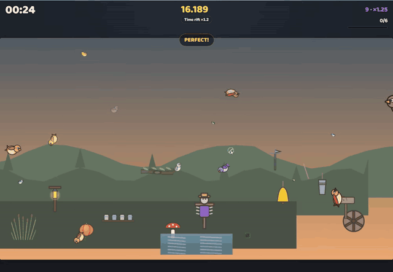
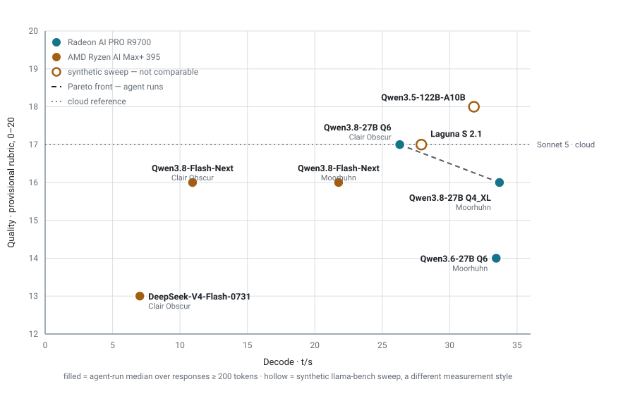
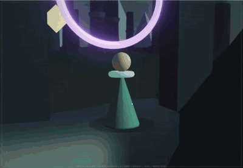
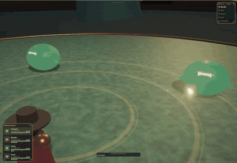
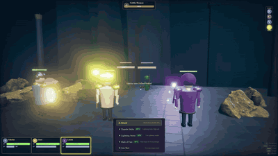
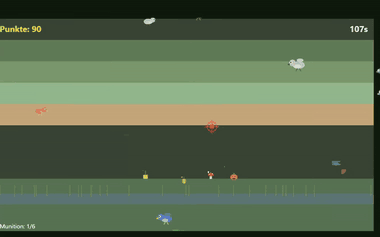
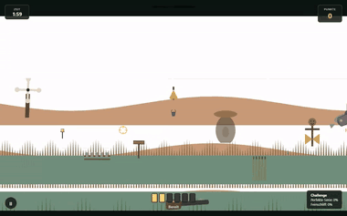
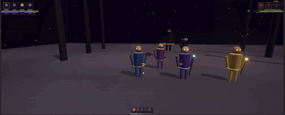
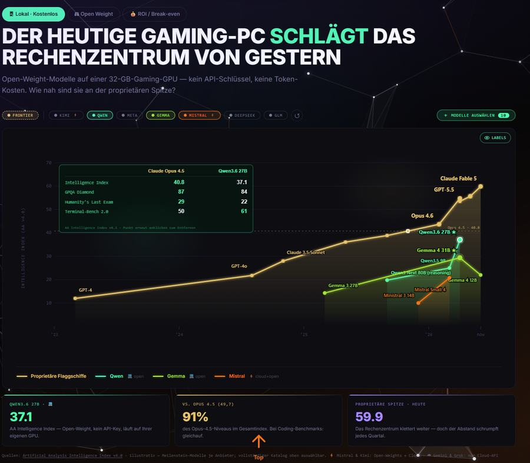

<div align="center">

<h1>Local AI on AMD</h1>

<p>
  <b>A usability benchmark for local LLMs — scored on the software they ship,<br>
  not on the questions they answer.</b>
</p>

<p>
  Seven models. Two AMD machines. <b>1,299,666 tokens</b> of unattended agentic work.<br>
  Every number below is re-derived from a raw <code>llama.cpp</code> server log that ships
  in this repository.
</p>

<p>
  
  
  
  
  <br>
  
  
  
  
  
  
</p>

<p>
  <a href="#measured-throughput">Results</a> ·
  <a href="#what-the-models-actually-shipped">Artifacts</a> ·
  <a href="#four-findings-that-contradict-the-model-cards">Findings</a> ·
  <a href="#context-depth-is-the-number-that-matters">Depth</a> ·
  <a href="#the-two-benches">Benches</a> ·
  <a href="#verify-every-number">Evidence</a> ·
  <a href="#the-data">Data</a>
</p>

<br>



<sub><b>No human wrote a line of this.</b> Qwen3.8-27B at Q4 built <i>Moorland Mayhem</i> —
five game modes, combo chains, score multipliers, a persistent highscore table and
colour-blind palettes — in one unattended session on a €1,500 Radeon, correcting itself four
times. <a href="evidence/logs/qwen38-27b-q4xl-moorhuhn-r9700.log">Its server log is in this
repo.</a></sub>

</div>

---

> [!NOTE]
> Almost every local-LLM speed figure you have read is `pp512` / `tg128`: a few hundred tokens,
> a cold cache, a quiet machine. A coding agent works at **50,000–180,000 tokens of context for
> hours on end**. Measured side by side, **the lab number is roughly twice what you actually
> get.** This repository publishes the second number — and ships the logs it came from.

## Why this exists

I wanted one question answered and could not find it answered anywhere: **can you actually work
with a local model on AMD hardware?** Not "does it score 61 on Terminal-Bench" — can you hand it
a real feature at 4 p.m. and have something that runs by dinner?

So this is not a question set. Each model gets the same brief in **VS Code Copilot Chat**,
pointed at a `llama-server` on the local network, and is then left alone for hours. What it
ships is a playable build. What the server log records is what it cost.

Three things get measured here that no leaderboard reports:

| | |
|---|---|
| **Agentic throughput** | The median decode rate across hundreds of *real* responses, not a synthetic burst. |
| **Self-repairs** | How many times a model had to patch its own broken code before it worked. This is the number that decides whether you want to work with a model. |
| **Depth decay** | Throughput at the context depth agents actually live at, not at 512 tokens. |

---

## Measured throughput

<div align="center">
<picture>
  <source media="(prefers-color-scheme: dark)" srcset="media/chart/field-dark.svg">
  
</picture>
</div>

> [!IMPORTANT]
> **There is no overall ranking here, and the tables below are not one.** Any weighting of
> speed against quality is an opinion, so this repository does not publish a total score.
> Decode t/s is a property of **model size, memory bandwidth and speculation settings** — not
> of how good a model is. Read the chart for the trade-off; read the tables for the numbers.

Three things the chart says that a speed-ordered column cannot:

- **Fast does not mean good.** Qwen3.6-27B Q6 is the second-fastest run in the field and the
  *weakest* Qwen on the quality axis — 14, with 15 self-repairs.
- **Qwen3.8-Flash-Next is level with the fastest run on quality (16) at half the speed**, and
  it is the only model scoring the same on both briefs. Its low t/s is a memory-system
  result: ~177 B of weights, ~6 B active, reached over ~256 GB/s of unified LPDDR5X with MoE
  routing moving the working set every token. That is not a capability measurement.
- **The highest local quality score in the dataset sits on the AI MAX 395** — Qwen3.5-122B-A10B
  at 18, above every R9700 run — and it only has a synthetic sweep, so no speed-ordered table
  would ever show it.

Only two runs are on the **Pareto front**: Qwen3.8-27B Q6 (26.30 t/s, quality 17) and
Qwen3.8-27B Q4_XL (33.69 t/s, quality 16). Everything else is beaten on both axes at once.

Tables are grouped by task, because Moorhuhn and Clair Obscur are different briefs and rows
across them are not comparable. Within each table rows run fastest-first; the bar is scaled
against the fastest run in the whole field, so bar lengths mean the same thing in both tables.
**Every row links to the log it came from.**

### Moorhuhn — 2D arcade shooter

| Model | Quant | Machine | n | Decode median | | Quality † | Self-repairs | Tokens | GPU time | Log |
|---|---|---|--:|--:|---|--:|--:|--:|--:|:-:|
| **Qwen3.8-27B** | UD-Q4_K_XL | R9700 | 82 | **33.69** t/s | `████████████` | 16 | **4** | 332,405 | 189 min | [log](evidence/logs/qwen38-27b-q4xl-moorhuhn-r9700.log) |
| **Qwen3.6-27B** | UD-Q6_K_XL | R9700 | 221 | **33.45** t/s | `████████████` | **14** | **15** | 175,743 | 139 min | [log](evidence/logs/qwen36-27b-q6-moorhuhn-r9700.log) |
| **Qwen3.8-Flash-Next** | UD-Q4_K_XL | AI MAX 395 | 98 | **21.82** t/s | `████████` | 16 | — | 285,339 | 286 min | [log](evidence/logs/qwen38-flashnext-moorhuhn-halo.log) |
| Sonnet 5 · *cloud reference* | — | cloud | — | *no local rate* | | 17 | 2 | — | — | *artifact only* |

<sub>Percentile spread, decode p10 – p90: Qwen3.8-27B 27.8 – 45.3 · Qwen3.6-27B 29.0 – 38.3 ·
Flash-Next 17.2 – 26.7. Peaks 84.9 / 41.4 / 33.9 t/s.</sub>

### Clair Obscur — 3D turn-based RPG

| Model | Quant | Machine | n | Decode median | | Quality † | Self-repairs | Tokens | GPU time | Log |
|---|---|---|--:|--:|---|--:|--:|--:|--:|:-:|
| **Qwen3.8-27B** | UD-Q6_K_M | R9700 | 30 | **26.30** t/s | `█████████▌` | **17** | 6 | 118,919 | 115 min | [log](evidence/logs/qwen38-27b-q6-clairobscur-r9700.log) |
| **Qwen3.8-Flash-Next** | UD-Q4_K_XL | AI MAX 395 | 92 | **10.93** t/s | `████` | 16 | — | 236,460 | 368 min | [log](evidence/logs/qwen38-flashnext-clairobscur-halo.log) |
| **DeepSeek-V4-Flash-0731** | UD-IQ3_XXS | AI MAX 395 | 98 | **7.02** t/s | `██▌` | **13** | 12 | 150,800 | 500 min | [log](evidence/logs/deepseek-v4-flash-clairobscur-halo.log) |
| **Qwen3.6-27B** | UD-Q6_K_XL | R9700 | — | *log not parsed* | | 15 | — | — | — | — |

<sub>Percentile spread, decode p10 – p90: Qwen3.8-27B 18.0 – 35.3 · Flash-Next 9.7 – 13.9 ·
DeepSeek 4.9 – 9.9. Peaks 42.4 / 17.0 / 10.8 t/s. The two Flash-Next rows differ by MTP
speculation, not by model — see finding 4.</sub>

### Synthetic sweeps — same machine, different measurement style

Kept in the section rather than in a distant side table, because leaving them out is how the
AI MAX 395's quality showing goes missing. They have no agent log, so they carry no `n`, no
token count and no place on the Pareto front.

| Model | Quant | Machine | Prefill (pp512) | Decode (tuned) | Draft acceptance | Quality † | Report |
|---|---|---|--:|--:|--:|--:|:-:|
| **Qwen3.5-122B-A10B** | UD-Q4_K_XL | AI MAX 395 | 245.71 t/s | 31.80 t/s | **0.866** | **18** | [report](evidence/reports/qwen35-122b-a10b-strix-halo-vulkan-benchmark.md) |
| **Laguna S 2.1** · 118B-A8B | Q4_K_M | AI MAX 395 | 309.64 t/s | 27.90 t/s | 0.559 | 17 | [report](evidence/reports/laguna-s21-strix-halo-vulkan-benchmark.md) |

> [!WARNING]
> **Do not read those two rows against the agentic ones.** Where both measurement styles exist
> for the same model, the synthetic figure ran about **2× the agentic one**. The quality column
> is comparable across all three tables; the speed column is not.

> [!CAUTION]
> **† Quality is provisional and it is the weakest thing on this page.** Human-assigned on a
> 20-point scale, no published protocol, and the whole local field lands between 13 and 18 in
> whole integers — too coarse to separate three runs tied at 16. **Do not sort by it, and do not
> quote it as a result.** Writing the rubric is the first item under
> [what is missing](#what-is-missing); until it exists, the y axis of that chart is an opinion
> with error bars nobody has drawn.

---

## What the models actually shipped

Every clip is the model's own build, recorded from the shipped `dist/` — no edits, no human
touch-ups, no cherry-picked frames.

<table>
<tr>
<td width="33%" valign="top">

<b>Clair Obscur</b><br>
<sub>Qwen3.8-27B UD-Q6_K_M · R9700<br>
Turn-based party combat with an AP economy, boss phases, parry timing and dialogue. Highest
quality score of any agent run, and one of the two runs on the Pareto front.</sub>
</td>
<td width="33%" valign="top">

<b>Clair Obscur</b><br>
<sub>Qwen3.8-Flash-Next UD-Q4_K_XL · AI MAX 395<br>
Four-character party, turn-order panel, enemy nameplates with health bars, an expedition
roster — and a French-language UI it chose on its own.</sub>
</td>
<td width="33%" valign="top">

<b>Clair Obscur</b><br>
<sub>Qwen3.6-27B UD-Q6_K_XL · R9700<br>
Third-person exploration with volumetric fog, physics colliders and combat markers. The
artifact exists; its log is not parsed yet.</sub>
</td>
</tr>
<tr>
<td width="33%" valign="top">

<b>Moorhuhn</b><br>
<sub>Qwen3.6-27B UD-Q6_K_XL · R9700<br>
Parallax layers, scoring, ammo, round timer. Also <b>15 self-repair scripts</b> — see below.</sub>
</td>
<td width="33%" valign="top">

<b>Moorhuhn</b><br>
<sub>Sonnet 5 · cloud reference<br>
The control group. Same brief, a frontier model, so the local results have a ceiling to be read
against.</sub>
</td>
<td width="33%" valign="top">

<b>Clair Obscur</b><br>
<sub>Laguna S 2.1 · AI MAX 395<br>
From the coding evaluation in its report. No agent-log run yet, so it appears only in the
synthetic table.</sub>
</td>
</tr>
</table>

> [!IMPORTANT]
> **The cleanest experiment in this dataset is the build at the top of this page against the
> Qwen3.6-27B Moorhuhn tile.** Same task, same machine,
> decode medians 0.7 % apart — 33.69 against 33.45 t/s. One shipped *Moorland Mayhem* with
> accessibility options, persistent highscores and five game modes, after **4** self-repairs.
> The other needed **15** and scored two rubric points lower. Identical throughput, entirely
> different afternoons. Whatever decode t/s measures, it is not that.

### Self-repairs: the metric nobody reports

Left alone, a model does not fail cleanly — it writes another patch script. The project folder
of the Qwen3.6-27B Moorhuhn run contains fifteen of them:

```
fix_hit.cjs            fix_coords_final.cjs      fix_hitbox_big.cjs
fix_coords_proper.cjs  fix_hit_v2.cjs            … 10 more
```

Fifteen attempts at one hit test. Across the four runs where they were counted, **37 self-repair
scripts** were left behind — and the two runs with the fewest (4 and 6) produced the two best
artifacts. None of that shows up in a decode median, and it is exactly what you feel when you
work with a model all afternoon.

---

## Four findings that contradict the model cards

These took weeks to find, and each one links to the protocol it came from. They are the reason
this repository is worth more than its tables.

### 1. The documented speculation depth destroys throughput

Laguna S 2.1's model card recommends `--spec-draft-n-max 15`. On bandwidth-bound hardware that
is a **2.5× collapse** — well below the rate you get with no speculation at all:

| Setting | Decode | Draft acceptance | vs. no speculation |
|---|--:|--:|--:|
| `--spec-draft-n-max 15` *(model card default)* | 8.1 t/s | 0.150 | **0.40×** |
| speculation off | 20.4 t/s | — | 1.00× |
| `--spec-draft-n-max 3` *(measured optimum)* | **27.9 t/s** | 0.559 | **1.36×** |

Deeper drafting barely raises mean accepted length (2.29 → 3.24) while acceptance *ratio*
collapses (0.645 → 0.150) — you pay linearly more draft cost for almost no extra accepted
tokens. Qwen3.5-122B-A10B is the same story with a smaller blast radius: against a 20.55 t/s
baseline, the optimum at `n_max 2` reaches 31.80 t/s while Unsloth's example value of `6` gets
27.68 — **13 % below**. **The optimum is sharp**; sweep it on your own machine.

<sub>Sources: [Laguna report §5.3, §6.2](evidence/reports/laguna-s21-strix-halo-vulkan-benchmark.md) ·
[Qwen3.5 report §5.3](evidence/reports/qwen35-122b-a10b-strix-halo-vulkan-benchmark.md)</sub>

### 2. Both published sampling presets are wrong for thinking-mode coding

Unsloth's "precise coding" preset ships `presence_penalty 0.0`, `min_p 0.0` and
`repetition_penalty 1.0` together — safe for instruct mode, unbounded in thinking mode. On an
identical task, varying only the sampling:

| Config | temp | presence | repeat | min_p | Tokens | Wall | Finish | |
|---|--:|--:|--:|--:|--:|--:|---|---|
| **A** *(Unsloth "precise coding")* | 0.6 | **0.0** | 1.0 | 0.0 | **32,768** | 1,087 s | `length` | **FAIL** |
| **B** *(adopted)* | 0.6 | **1.5** | 1.0 | 0.0 | **7,680** | **297 s** | `stop` | **PASS** |
| **C** | 0.6 | 0.0 | **1.05** | **0.05** | 8,453 | 333 s | `stop` | PASS |
| **D** | **1.0** | 1.5 | 1.0 | 0.0 | 12,456 | 540 s | `stop` | PASS |

Config A never terminated — it ran to the context ceiling. **Any** anti-repetition mechanism
prevents the runaway; having none engaged causes it. What works is a mix no published preset
offers: **temperature 0.6 with `presence_penalty 1.5`**.

<sub>Source: [Qwen3.5 report §5.4](evidence/reports/qwen35-122b-a10b-strix-halo-vulkan-benchmark.md)</sub>

### 3. Reserving more VRAM on unified memory buys nothing

Enlarging the BIOS UMA carve-out on the Ryzen AI Max+ 395 does not help, and costs you the OS.
Dedicated VRAM and GTT are the *same* LPDDR5X-8533 on this silicon — the carve-out is an
address-space reservation, not distinct memory, so there is no bandwidth to recover. Decode held
at 20.4–20.7 t/s (±1.5 %) across all tasks even though this MoE moves its working set between
both regions every token; a real GTT penalty would show up as variance. Even at a 262,144-token
context the GPU peaked at **86.09 GiB with 25.56 GiB still free**. Published Strix Halo tuning
guidance goes the *other* way and shrinks the carve-out to its 512 MB minimum.

Memory is not what limits this machine. Time is.

<sub>Source: [Laguna report §6.3](evidence/reports/laguna-s21-strix-halo-vulkan-benchmark.md)</sub>

### 4. Speculative decoding is worth about 2× in real agent work, not just in the lab

The two Qwen3.8-Flash-Next runs are the same model and quant on the same machine. The September
run had **MTP shared-Q8_0 speculative decoding on** (`n_max 2`); the August run had none:

| Run | Speculation | Context | Decode median | Log |
|---|---|--:|--:|:-:|
| Moorhuhn, September | **MTP shared-Q8_0, `n_max 2`** | 131,072 | **21.82** t/s | [log](evidence/logs/qwen38-flashnext-moorhuhn-halo.log) |
| Clair Obscur, August | none | 262,144 | **10.93** t/s | [log](evidence/logs/qwen38-flashnext-clairobscur-halo.log) |

That is **2.00×** — landing inside the **1.84–2.13×** range the run's own log header records for
MTP measured in isolation. Two independent measurements agreeing is the interesting part: the
lab figure for speculation actually survived contact with a five-hour agent session, which is
not true of raw throughput.

> [!CAUTION]
> This is corroboration, not a clean A/B. The two runs also differ in task, context size and
> reasoning budget. It is reported as agreement between two measurements, not as an isolated
> effect.

<details>
<summary><b>Bonus finding — where the depth decay actually comes from</b></summary>

<br>

On the R9700, roughly **four fifths of the throughput lost to context depth traces back to
speculation collapsing**, not to memory bandwidth or attention cost. Decode rate correlates with
mean accepted draft length at **r = +0.804**, against **r = +0.464** for raw draft acceptance.

The practical consequence: at deep context you are not fighting physics, you are fighting a
draft model that has stopped guessing well — a tunable problem, not a hardware ceiling.

<sub>Source: [R9700 quant evaluation](evidence/reports/qwen38-27b-rdna4-quant-eval.md), section
"Spekulation: mean len schlägt Akzeptanz"</sub>

</details>

---

## Context depth is the number that matters

Peak t/s is measured on an empty context. Agents never work on an empty context.

**Prefill vs. depth** — Radeon AI PRO R9700, Qwen3.8-27B UD-Q6, build `bd9bd1b`, sampled across
a single 180,396-token task:

| Depth | 8 K | 16 K | 34 K | 67 K | 100 K | 132 K | 164 K |
|---|--:|--:|--:|--:|--:|--:|--:|
| Prefill | **498.3** | 423.1 | 323.0 | 223.3 | 172.4 | 139.6 | **118.0** t/s |
| | `█` | `▇` | `▅` | `▃` | `▂` | `▁` | `▁` |

A **4.2× fall**. That one 180,396-token prompt took **16.6 minutes before the first character
came back** — and it is the largest prompt in the whole dataset, visible as the biggest
`prompt eval time` entry in
[that run's log](evidence/logs/qwen38-27b-q6-clairobscur-r9700.log).

**Decode vs. depth** — Ryzen AI Max+ 395, Qwen3.8-Flash-Next UD-Q4_K_XL, build `580e88d`:

| Context | 512 | 1 K | 2 K | 4 K | 16 K | 32 K | 64 K | 128 K | 164 K |
|---|--:|--:|--:|--:|--:|--:|--:|--:|--:|
| Decode | 22.14 | **22.50** | 21.99 | 21.66 | 19.04 | 16.65 | 12.25 | 8.84 | **7.70** t/s |
| Retained | 100 % | 102 % | 99 % | 98 % | 86 % | 75 % | 55 % | 40 % | **35 %** |
| | `█` | `█` | `█` | `█` | `▆` | `▅` | `▃` | `▂` | `▁` |

Two thirds of your throughput is gone by the time an agent has finished reading your codebase.
**Depth behaviour, not peak throughput, decides whether a model is usable.**

<sub>Sources: [prefill curve](evidence/reports/qwen38-27b-rdna4-quant-eval.md) ·
[decode curve](evidence/reports/qwen38-flashnext-depth-curve.md) with raw
[`llama-bench` sweeps](evidence/csv/)</sub>

---

## The two benches

<table>
<tr>
<th width="50%">Radeon AI PRO R9700</th>
<th width="50%">AMD Ryzen AI Max+ 395</th>
</tr>
<tr valign="top">
<td>

`gfx1201` · RDNA4 · **32 GB dedicated**

| | |
|---|---|
| Allocatable | 32,624 MiB |
| CPU | Intel Core Ultra 7 265KF |
| System RAM | 63.6 GiB |
| Board | ASUS PRIME Z890-P WIFI · BIOS 2401 |
| Driver | Adrenalin 26.6.4 |
| Vulkan ICD | `amdvlk64` 9.2.10.395 |
| OS | Windows 11 Pro 26200 |
| Note | Headless; an RTX 5080 drives the desktop |
| Street price | from ~€1,500 |

</td>
<td>

`gfx1151` · AMD Halo / Strix Halo · Radeon 8060S · **128 GiB unified**

| | |
|---|---|
| Memory | 128 GiB LPDDR5X-8533, 8 channels |
| Bandwidth | ~256 GB/s theoretical |
| Visible to Windows | 63.6 GiB |
| UMA reservation | 64.4 GiB |
| Vulkan heap | 98,123 MiB · 93,217 MiB free |
| Driver | 32.0.31021.5001 |
| Vulkan SDK | 1.4.350.0 (LunarG) |
| OS | Windows 11 Pro 26200 |
| Chassis | Ecotech / GMKtec Evo X2 |
| Street price | from ~€1,800 |

</td>
</tr>
</table>

> [!CAUTION]
> **The Ryzen AI Max+ 395 does not have 128 GB of VRAM.** It has 128 GiB of *unified* LPDDR5X.
> Windows reports 63.6 GiB, the BIOS reservation is 64.4 GiB, and Vulkan advertises a
> 98,123 MiB heap. Quote any one of those figures on its own and you are saying something false
> — which is why `data/hardware.json` carries all of them.

Both machines run **llama.cpp on the Vulkan backend**. No ROCm, no BIOS tinkering, no enlarged
memory reservation. Builds in play: `b10717`, `bd9bd1b` (TheTom fork), `b9985`, `580e88d`
(qwen4exp), `04b2b72` (poolside). Each log's own header records the exact build, context size,
KV type, speculation setting and sampling for that run.

---

## Verify every number

Nothing here is hand-typed. The raw logs ship in [`evidence/`](evidence/), each with a SHA-256,
and the parser that produced every published figure reads *those* files:

```bash
git clone https://github.com/KaiFelixBennett/local-ai-amd-benchmark
cd local-ai-amd-benchmark

cd evidence && sha256sum -c SHA256SUMS && cd ..   # the raw files are the ones cited
python scripts/parse_logs.py                      # re-derive every published figure
```

The parser needs only Python 3, no dependencies. It prints the table above and checks each log
against `SHA256SUMS` as it goes. **If a number in this README disagrees with what the script
reads out of the logs, the script is right.**

| | |
|---|---|
| [`evidence/`](evidence/) | 22 raw files, 3.9 MB — six `llama.cpp` server logs, six measurement protocols, ten CSV tables |
| [`evidence/README.md`](evidence/README.md) | **Claim-to-source map**: every published figure, and the exact file and section backing it |
| [`evidence/SHA256SUMS`](evidence/SHA256SUMS) | Checksum of all 22 |
| [`scripts/parse_logs.py`](scripts/parse_logs.py) | The parser. `--json` for machine-readable output; pass a path to analyse a log of your own |
| [`scripts/verify_runs.py`](scripts/verify_runs.py) | Cross-checks `data/runs.json` against the same logs, independently of the parser. Both must agree |
| [`scripts/make_chart.py`](scripts/make_chart.py) | Regenerates the field chart from `data/runs.json`, so the picture cannot drift from the data |

The logs are `llama-server` telemetry only — `print_timing` slot lines, load and config output.
They carry no prompt text and no response text, so there was nothing in them to redact.

> [!TIP]
> `evidence/README.md` also lists what is **not** evidence-backed — the quality rubric, the
> self-repair counts, the street prices, and energy, which is not measured at all. A benchmark
> that hides that line is marketing.

---

## The data

```
data/runs.json        12 runs — decode, prefill, percentiles, tokens, self-repairs, GPU time,
                      the full llama-server command line, and an `evidence` field naming the
                      log and its SHA-256
data/configs.json     19 complete llama-server launch configurations from the .bat files
data/hardware.json    both benches, every memory figure, drivers, Vulkan versions
evidence/             the raw logs, reports and CSVs behind every number
scripts/parse_logs.py the parser
scripts/verify_runs.py    independent cross-check of data/runs.json against the logs
scripts/make_chart.py     regenerates media/chart/ from data/runs.json
media/                full-length recordings of each shipped build, plus the README's GIFs
```

Each run carries its launch line verbatim and a pointer to its own log, so a result, the
configuration that produced it, and the evidence for it can never drift apart:

```jsonc
{
  "slug": "qwen38-27b-q4xl-moorhuhn-r9700",
  "model": "Qwen3.8-27B", "quant": "UD-Q4_K_XL", "hw": "r9700", "kind": "agent",
  "decode":  { "median": 33.69, "p10": 27.83, "p90": 45.31, "peak": 84.92, "n": 82 },
  "prefill": { "median": 241.47, "max": 499.49, "n": 101 },
  "tokens": 332405, "tokens_all": 336107, "responses_all": 108,
  "gpu_minutes": { "decode": 162.1, "prefill": 26.8 },
  "largest_prompt_tokens": 139720, "fixes": 4,
  "spec": "draft-mtp + ngram-mod 24/48/64 · n_max 2",
  "build": "b10717", "ctx": 262144, "kv": "q8_0 / q8_0", "ub": 288,
  "cmd": "llama-server -m Qwen3.8-27B-UD-Q4_K_XL.gguf …",
  "evidence": {
    "log": "evidence/logs/qwen38-27b-q4xl-moorhuhn-r9700.log",
    "sha256": "8c8d3460492763d102d026adb4f0941f2647c846ad404119adc8eb2d3dff0a40"
  },
  "source": "llama.cpp server log, 82 of 108 responses at >=200 tokens; re-derived by scripts/parse_logs.py"
}
```

> [!TIP]
> The point of this repository is **not** that you re-run the benchmark. It is that you copy the
> launch line for your hardware out of `data/configs.json` and get the same performance in your
> own editor this afternoon.

---

## Vision benchmark

Two images that are provably in nobody's training set, because they were made for this.

<div align="center">

</div>

**Image A — dashboard.** A comparison tooltip carrying 4 × 2 figures, three KPI tiles, active
filter chips, series labels, axis labels and footnotes across five type sizes. Two tasks:
*extract* it to JSON, then *rebuild* the line chart as standalone SVG. Only what is visible in
the image is scored — never anything a model could answer from world knowledge, or you are
measuring memory instead of perception.

**Image B — convention stand.** 40+ objects, dual-currency price tags, occlusion, glare. Scored
as precision / recall / hallucination rate over `{name, gbp, eur}`. One tag lists the currencies
in reversed order as a deliberate trap.

> [!NOTE]
> **Image B is deliberately not in this repository.** People are recognisable in it, and
> automatic face blurring fails at the size those faces occupy. It ships once the faces have been
> redacted by hand. Both images are pinned by SHA-256 before any model sees them, so it stays
> provable that every model was shown the same pixels.

---

## What is missing

Stated plainly, because a benchmark that hides its gaps is marketing.

| Gap | Affects | Status |
|---|---|---|
| **Quality rubric scores** | every run, and the y axis of the field chart | Provisional throughout: human-assigned, no published protocol, whole integers, and the entire local field inside 13–18. It cannot separate the three runs tied at 16 — which is exactly the comparison that matters most. This is the single most valuable thing missing from the project. |
| **Energy measurement** | both benches | Wh per 1,000 tokens is the strongest figure against a cloud API — and it is missing. Needs a wall meter or `amdsmi` sampling. |
| **Cloud reference runs** | Opus 5, GPT 5.6, Sonnet 5 | Sonnet 5 shipped an artifact; the logged runs are outstanding. |
| **One identical quant on both machines** | hardware comparison | Without it there is no true head-to-head, only two separate lists. |
| **Agent runs for Laguna and Qwen3.5** | AI MAX 395 | Both have artifacts and synthetic sweeps, but no agent log — so neither can join the Pareto front, and Qwen3.5's field-leading quality 18 rests on a sweep. |
| **Prefill for DeepSeek-V4-Flash at depth** | AI MAX 395 | Its 17.5 t/s prefill median is the lowest in the field and cost 171 of its 500 GPU minutes. Worth its own sweep. |
| **Sixth artifact's log** | Qwen3.6-27B · Clair Obscur | Artifact shipped, log not yet parsed. |
| **Vision reference image B** | vision benchmark | Withheld until the faces are redacted by hand. |

---

## Related projects

| | |
|---|---|
| [**llama-cpp-turboquant**](https://github.com/KaiFelixBennett/llama-cpp-turboquant) | llama.cpp fork with a TurboQuant KV cache — the `bd9bd1b` build used above |
| [**gemma4-turboquant-rdna4**](https://github.com/KaiFelixBennett/gemma4-turboquant-rdna4) | Gemma-4-31B at 256 K context on RDNA4 |
| [**hermes-claude-code-local**](https://github.com/KaiFelixBennett/hermes-claude-code-local) | Hermes Agent and Claude Code running locally against llama.cpp |
| [**RadeonForge**](https://github.com/KaiFelixBennett/RadeonForge) | QLoRA fine-tuning on Radeon via ROCm |

---

## License & citation

**Code MIT · measurement data CC-BY-4.0.** Quote the numbers, and please quote them with their
measurement style — agentic or synthetic — attached.

```bibtex
@misc{localaiamd2026,
  title        = {Local AI on AMD: a usability benchmark for local LLMs
                  on consumer AMD hardware},
  author       = {Bennett, Kai Felix},
  year         = {2026},
  howpublished = {\url{https://github.com/KaiFelixBennett/local-ai-amd-benchmark}},
  note         = {Raw llama.cpp server logs included; figures re-derivable
                  via scripts/parse_logs.py}
}
```

<div align="center">
<br>
<sub>Measured on hardware that fits under a desk · <a href="https://securesight.ai">securesight.ai</a></sub>
</div>
